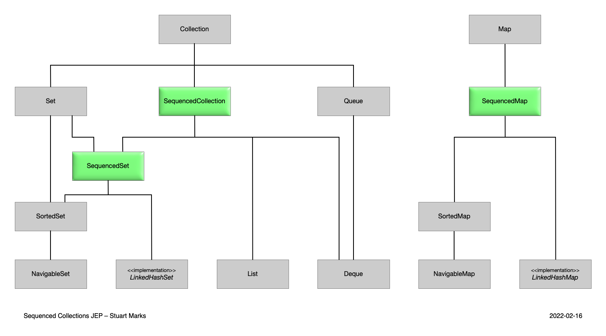

= Java 21: code and collections
:backend: revealjs
:revealjs_theme: adesso
:revealjs_controls: false
:revealjs_controlsTutorial: false
:revealjs_progress: false
:revealjs_slideNumber: false
:revealjs_history: true
:revealjs_center: true
:revealjs_transition: fade
:revealjs_backgroundTransition: fade

:imagedir: images

:icons: image
:icontype: svg
:iconsdir: ../../_shared/icons

// Edit host information
:host-name: INFODAYS Java 21
:host-url: https://www.infodays.de/java-lts
:host-logo-style: logo
:host-twitter-url: https://twitter.com/SIGSDATACOM
:host-twitter-name: @SIGSDATACOM
:host-logo-url: ../../_shared/images/hosts/info-days.ico

include::../../_shared/hightlightjs.adoc[]
include::../../_shared/events-on-title-and-footer.adoc[]
// ####################################################
// #            Presentation area  start              #
// ####################################################

== 🌺🌺️ 🆚 🧟️🧟‍

[.notes]
--
Kennt ihr dieses Legendräres Spiel?
Plants vs. Zombies in dem man mit Pflanzen gegen eine Zombiinvasion kämpf, geil!#
Da gibt es ein paar Scenen in denen die Zombis Forderungen stellen, eine solche wollen wir heute auch erzeugen.

Die Zombies fordern Geld oder sie fressen unsere Gehirne.
Weil sie das bei vielen Menschen versuchen, braucht die Zombi Inc. eine Software.
--

== 🧩
image::images/steckpuzzel.jpg[background,size=cover]

[.notes]
--
Hier betrachten wir die Erzeugzung der Texte.

Es geht im Strings, genauer um String in denen etwas rein soll.
So wie in dem Puzzel meines Kinds hier, der Baum und das Auto.
Das kommt regelmäßig überall vor und wir haben in Java viele Möglichkeiten das zu realisieren.
--

== String Concatenation
[source,java]
....
String invoiceTxt =
    "Hi " + name + ",\n"
  + "please send " + (value + tax) + "€ to us or we eat"
  + "your brain.\n\n"
  + "Sincerely\n"
  + "\tThe 🧟s";
....

* hard to read ❌
* hard to format ❌
* need for braces ❌

[.notes]
--
Bei der Konkationation von Strings muss immer " + x + " genutzt werden.
Dazu kommen Klammern wir value + tax vs (value + tax).
Formatierung des Strings ist auch eher horror.

Dafür technisch sehr einfach ;)
--

=== String Builder
[source,java]
....
String invoiceTxt = new StringBuilder()
  .append("Hi ").append(name).append(",\n")
  .append("please send ").append(value + tax)
    .append("€ to us or we eat you brain.\n\n")
  .append("Sincerely\n")
  .append("\tThe 🧟s")
  .toString();
....

* even worse to read ❌❌
* hard to format ❌
* very verbose ❌

[.notes]
--
StringBuilder bzw. StringBuffer sind "nur" programmatische Konkatination, es ist nicht mal Syntaktischer Zucker.
Immerhin müssen wir hier nicht noch klammern (value + tax), das ist klarer, dennnoch ist es ungeeignet.
Sie haben ihre Berechtigung bei dynmischer erzeugung von Strings.
--

=== String Format
[source,java]
....
String invoiceTxt = """
  Hi %s,
  please send %.2f€ to us or we eat you brain.

  Sincerely
    The 🧟s""".formatted(name, value + tax);
// pre Java 15
String.format("..", name, value + tax);
....

* better to read ✅
* easy to format ✅
* decouple parameter from String ❌

[.notes]
--
Hier geht es wirklich in die richtige Richtung, vor allem wenn wir noch TextBlocks verwenden.
Hier werden Platzhalter mit % eingeführt und ihnen ein Datentyp bzw. Format zugewiesen.
Das ist keine Konkatination mehr hier spricht man von String Format.

In dieser Kombination sparen wir und das Formatieren, generell ist der Text besser Lesbar.
Doch die Enkopplung von Format und Wert brirgt Probleme.
Es ist garnicht Compile Zeit Typsicher und auch zur Runtime nur bedingt.
Es führt oft zu Typ Missmatches wenn die IDE nicht hilft.
--

=== What do we want?
// background Mamoam Foto ;)

=== What do we want?
* Strings with runtime computed values
* readable mix of expressions and Strings
* easy Formatting of values

[.notes]
--
1. Kopplung von Format und Wert
2. Durch gäniger Lesefluss
3. Wenig verboser syntax
--

=== JEP 430 String Templates

[source,java]
....
String invoiceTxt = STR."""
  Hi \{ name },
  please send \{ value + tax }€ to us or we eat you brain.

  Sincerely
    The 🧟s""";
....

[.notes]
--
Wir haben hier zwei Neue Dinge im Gegensatz zu Format String mit Text Blocks.
StringTemplate, STR. und \{ }, fange wir hinten an.

\{ ist seit eniger Zeit eine nicht erlaubtes Escape Zeichen in Strings und zeigt nun den beginn einen Platzhalter an.
Innerhalb eine Plathalters ist eine Expression erlaubt welche zur Laufzeit ausgewertet und in den Finalen String eingefügt wird.

STR. gibt an mit welchem StringProcessor verwendet wird um das StringTemplate zu verarbeiten und die StringFragments mit den Werten zu kombinieren.
STR ist hierbei der STR (String) StringTemplateProcessor und STR."" ist nichts weiter als syntaktischer Zucker für einen Methodenaufruf.
Er prozessiert einen ein StringTemplate zu einem String, und es gibt noch weitere.
--

=== With Format
[source,java]
....
String invoiceTxt = FMT."""
  Hi %s\{ name },
  please send %.2f\{ value + tax }€ to us or we eat you brain.

  Sincerely
    The 🧟s""";
....

[.notes]
--
FMT zum beispiel ist der FormattedString StringProcessor.
Er kombiniert die Formatierungsmöglicheiten aus der Format String Methodik mit dem der StringProcessoren.

Hiermit ist nun alles zusammen, was wir wollen.
Format und Wert sind zusammen, ein Durchgäniger Lesefluss und nur eine Handvoll zeichen Syntax.
Ist das wirklich alles was wir wollen? Nein wir wollen auch erweitern.
--

=== are you entertained? meme here?

=== Code Behind
[source,java]
....
var SHUFFLER = StringTemplate.Processor.of(
(StringTemplate st) -> {
  var values = st.values().reversed().iterator();
  var sb = new StringBuilder();
  st.fragments().reversed()
    .forEach(frag -> sb.append(frag).append(values.next()));
  return sb.toString();
});

var JSON = StringTemplate.Processor
  .of(st -> new JSONObject(st.interpolate()));
....

[.notes]
--
Schlüssel zur implementierung eines eigenen Processors ist das Interface StringTemplate.processor mit seiner process Methode.
Diese bekommt ein StringTemplate als die Laufzeitrepräsentation.
Dieses hat eine Liste fragments und values, die ausgewerteten Werte der Platzhalter.
Die Fragmente sind die Strings vor und nach dem Platzhaltern.
--

=== Abschluss
//todo kleiner Abschluss

== 🛫 -> 🛬

[.notes]
--
Die Zombies versenden viele Nachrichten dieser Art oder auch Mahnungen.
Natürlich führt das zu juristischen Problemen und im Zweifel müssen sie tatsächlich losziehen und ein Haus stürmen.

Wie bei jeder Auseinandersetzung sich zu merken was die Schritte waren, doch Zombies sind nicht die hellsten also wird alles gespeichert.
--

=== Needs
* first and last letter
* keep order and travers revers
* add and remove at both ends

🤔List, (Sorted)Set, Deque 🧐

=== First'n'Last
[source,java]
....
// List
list.get(0); list.get(list.size() -1));
// Sorted Set at least
sortedSet.first(); sortedSet.last();
// Deque (double ended queue)
deque.getFirst(); deque.getLast();
....

👑Deque

=== Order'n'Reverse
[source,java]
....
// List
for(var it = l.listIterator(l.size()); it.hasPrevious();){ }
// sorted Set
sortedSet.descendingSet().forEach();
// Deque
for(var it = deque.descendingIterator(); it.hasNext();){ }
....

👑Sorted Set

=== Add'n'Remove
[source,java]
....
// List
l.add(0, "Hallo"); l.add("World");
// sorted Set
var tmp = new TreeSet<String>();
tmp.add("Hallo");
tmp.addAll(sortedSet);
tmp.add("World");
sortedSet = tmp;
// Deque
deque.addFirst("Hello"); deque.addLast("World");
....

👑Deque

=== And the winner is ⁉

[.notes]
--
laut unseres kleinen Wettbewerbes müssete es Deque sein.
Das ist aber eine riesiges interface mit vermischungen, ungewohntem Wording wir poll und offer.

Warum ist es eigentlich so uneinheitlich, da fehlt doch etwas?
--

=== The missing 🧩

[.notes]
--
Neben den bereits bekannten Verhaltensmustern "nur eine Instanze" (Set) und "Queue semantic" gibt es nun ein neues Verhalten mit Bezug zur Reihenfolge.

SequencedCollection fügt die Semantik der Ordnung in die API der Collections ein.
SequencedSet überschreibt nur reversed um weiterhin die Set-sematic zu transportieren.
SequencedMap definiert eine Ordnungssemantik in Maps und arbeitet mit SequencedSet und SequencedCollection
--

=== Sequenced Collection
[source,java]
....
interface SequencedCollection<E> extends Collection<E> {
  // new method
  SequencedCollection<E> reversed();
  // methods promoted from Deque
  void addFirst(E); void addLast(E);
  E getFirst(); E getLast();
  E removeFirst(); E removeLast();
}
....

see https://docs.oracle.com/en/java/javase/21/docs/api/java.base/java/util/SequencedCollection.html[SequencedCollection] JavaDoc.

=== Sequenced Set
[source,java]
....
interface SequencedSet<E>
    extends Set<E>, SequencedCollection<E> {
  SequencedSet<E> reversed();    // covariant override
}
....

see https://docs.oracle.com/en/java/javase/21/docs/api/java.base/java/util/SequencedSet.html[SequencedSet] JavaDoc.

=== Sequenced Map
[source,java]
....
interface SequencedMap<K,V> extends Map<K,V> {
  // new methods
  SequencedMap<K,V> reversed();
  SequencedSet<K> sequencedKeySet();
  SequencedCollection<V> sequencedValues();
  SequencedSet<Entry<K,V>> sequencedEntrySet();
  V putFirst(K, V); V putLast(K, V);
  // methods promoted from NavigableMap
  Entry<K, V> firstEntry(); Entry<K, V> lastEntry();
  Entry<K, V> pollFirstEntry(); Entry<K, V> pollLastEntry();
}
....

see https://docs.oracle.com/en/java/javase/21/docs/api/java.base/java/util/SequencedMap.html[SequencedMap] JavaDoc.

=== Abschluss

== learn Java, it's easy
image::images/auto-feldweg.jpg[background,size=cover]

[.notes]
--
Java ist eine Sprache mit Enterprise Fokus.
Der Einstiegserfahrung wurde nicht besonders viel Aufmerksamkeit geschenkt.

Erinnert euch mal daran wie oft ihr Dinge akzeptieren musstet am Anfang.
--

=== Main
[source,java]
....
public class Main {
  public static void main(String[] args) {
    System.out.println("Hello 🧟‍-Land");
  }
}
....

[.notes]
--
Enthaltene Konzepte sind 10

* class
* visibility
* static
* methods
* method parameter
* variables
* array
* method call
* entry point

--

=== Flexible launching
Allow all non-private classes

from 3 default constructor mandatory

. `static void main(String[] args)`
. `static void main()`
. `void main(String[] args)`
. `void main()`

[.notes]
--
Versteckte Konzepte die den Einstieg erleichtern:

* Starten von einer Instance-main Methode
* keine static main mit parameter String[] aber static main without parameter take that
* keine static main methode aber non-private NoArgsConstructor and a non-private main methode then construct the class and call main
* wenn eine main methode mit parametern da ist call diese, sonst die ohne parameter
--

=== Flexible launching
[source,java]
....
public class Main {
  public static void main(String[] args) {
    System.out.println("Hello 🧟‍-Land");
  }
}
....

[source,java]
....
class Main {
  void main() {
    System.out.println("Hello 🧟‍-Land");
  }
}
....

[.notes]
--
Durch das neue flexibile lauch protokoll kann das Programm zuammmen gekürzt werden.
Jetzt muss "nur" noch das Konstruct Class akzeptiert werden, doch das kommt auch noch weg.

Dazu die Frage, wo genau "legt" diese Klasse, also zu welchem Package gehört sie.
--

=== Grind the Gears!
image::images/closeup-shot-dirty-metal-gears-grid-light.jpg[background,size=cover]

[.notes]
--
Die Klasse ist der Startpunkt und referenziert andere Klassen.
Der Startpunkt sollte idr. nicht referenziert werden (circular dependency).
Sie braucht also keinen Namen, package und module.

Um eine Instanz zu erzeugen braucht es auch keine Konfiguration, also keinen besonderen Konstruktor.

Hier lässt sich doch eine kleine Einschränkung einbauen und dann passt das Lauchnprogramm mit rein!

Auftritt Unnamed Class
--

=== Unnamed Class

==== SomeName.java

[source,java]
....
void main() {
  System.out.println("Hello 🧟-Land");
}
....

==== 🚀 Launch 🚀

[source,shell]
....
$ java SomeName.java
Hello 🧟-Land
....

[.notes]
--
Einschränkung ist: alles kommt in eine Klasse

Dann implizieren wir: Die Klasse die hat keinen Namen, lebt im unnamed package im unnamed module

schon kann die Klasse gelaunched werden und die Einsteiger:innen müssen genau minimal wenig kennenlernen.
okay Script Sprachen brauchen noch weniger, aber irgendwo ist schluss
--

== Combine

[source,java]
....
void main() {
    System.out.println("Goodbye Info Days")
}
....

++++

    
    

++++

=== Print invoice

[source,java]
....
int value = 34;
double tax = value * 0.1;
List<String> brainCarrier = //..

void main() {
  FMT."""
  Hi %s\{ brainCarrier.reversed().getFirst() },
  please send %.2f\{ value + tax }€ to us or we eat you brain.

  Sincerely
    The 🧟s""";
}
....

// ####################################################
// #            Presentation area  end                #
// ####################################################
include::../../_shared/about-slide.adoc[]
include::images/_sources.adoc[]
