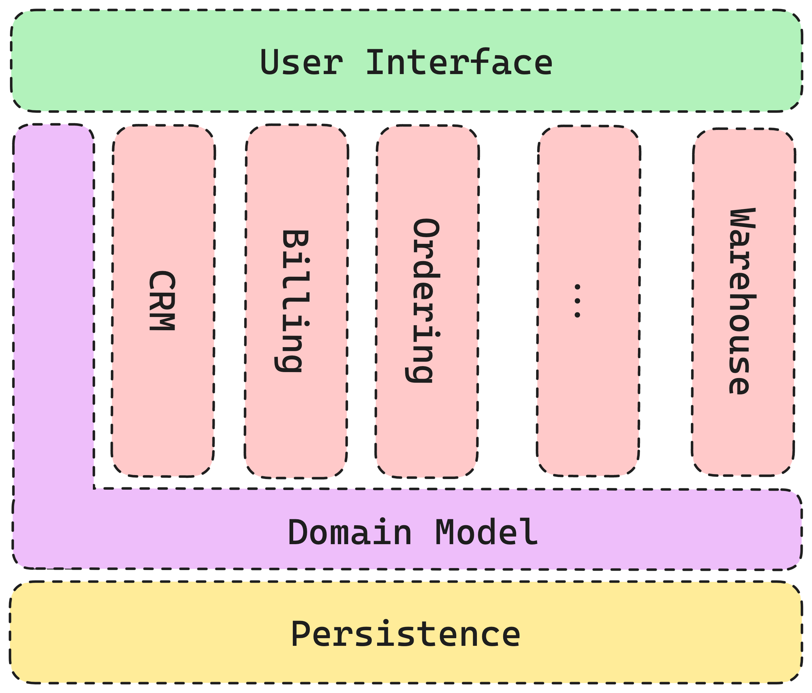
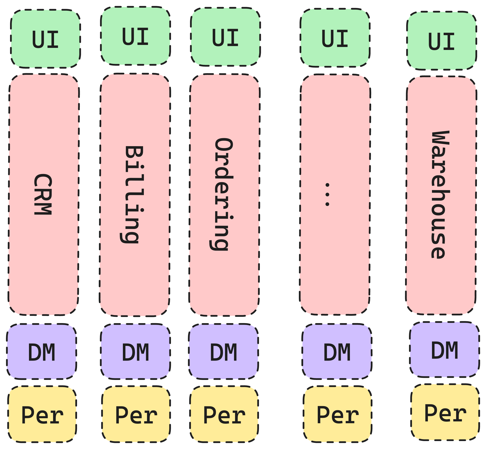

== Data Oriented Programming?
image::images/mann-gekleidet-mit-pfeilen-ueber-den-kopf.jpg[background,size=cover]

=== Monolithic history

[.notes]
--
Bach 10 year+ back in time Application usually solved the problem for an organisation with one solution.
Applications back then where developed to model one organisation at a time.
May they be whole companies or "only" one department, big monilithic applications were developed.
It's nothing wrong with one UI and shared model to with modules doing *there* thing.
It simply does not scale that idependently and are not that easyly updated one by one.
--

=== Self-Contained Systems

[.notes]
--
I hope that was the reason why your applications were migrated to microservivces.
Microservices or Self-contained Systems are more oriented on doing one thing i.e. Process or process steps correctly and are there for tighter tided to the data.
--

=== Even smaller
image::images/konzept-der-cyber-server-cloud-datenspeicherung-cloudscape-digitaler-online-rack-service-fuer-globale-netzwerk-datenbank-backup-computer-sicherheitsinfrastrukturtechnologie.jpg[text,700]

[.notes]
--
Application are even more tide to data of you done the lifting into the cloud.
With Azure Functions or AWS Lamdas the data is even more in focus and less the overall process/organization.
Functions do a thing with data, but the data only has a shape no logic.
Logic is implemented dependently from the data.

With the architecure the way of programming envoled also.

Data Oriented Programming focuses on the data and enforces the separation of data and logic.
This enables the possibility to modle Domain as immutable, error state free, nothing but the data
Features (in terms of new logic) does not infer domain objects, it grows besides.
--

=== Data Orientation means

* Data is Data and nothing but the data
* Strict separation between data and logic
* like functional programming

[.notes]
--
Data Oriented Programming focuses on data and the separation between data and logic
guides:

* focus on empty interfaces
* no logic in classes
* static Methods without state do the "heavy" lifting

This enables the possibility to modle Domain as immutable, error state free, nothing but the data
Features (in terms of new logic) does not infer domain objects it grows besides
--
