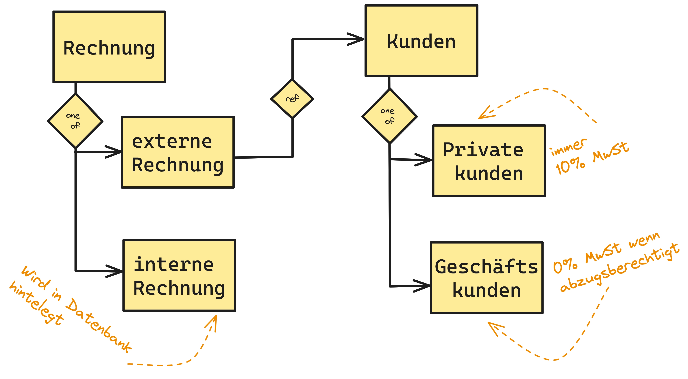
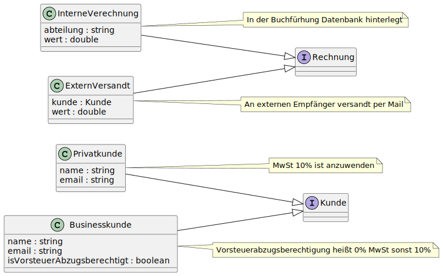

== How to DOP

=== Analyze Domain

[.notes]
--
1. Es gibt Rechnungen und Kunden
2. Rechnungen können intern oder extern sein
3. interne Rechnunngen werden in den Büchern gespeicher
4. externe Rechnungen können an Privatkunden oder Businesskunden gehen
5. Businesskunden können Vorsteuerabzugsberechtigt
6. Auf Rechnungen werden 10% Steuern erhoben, außer Kunden sind Abzugsberechtigt
--

=== Model only valid state
// no use of raw type
// restrict extension wherever possible

[.notes]
--
Records or Immutable values

Interfaces represent choice in type, like Privat-/Businesskunden or Rechnungen

No methods/interactions only connections.

--

=== Write Domain

[source,java]
....
sealed interface Rechnung
  permits InterneVerechnung, ExternVersandt {}

record ExternVersandt(Kunde kunde, double wert)
  implements Rechnung {}

record InterneVerechnung(String abteilung, double wert)
  implements Rechnung {}
....

[.notes]
--
sealed Rechnung because it can only have 2 types, other types are not modeled into the domain.
sealed interfaces since Java 17

Records (implicitly final) available since Java 16

Both since 2021!!!

String and double are not mutable, nice!
But String could be null, and about mutable data?
--

=== Write Domain
[source,java]
....
// omitted interface Kunde and record Businesskunde

record Privatkunde(String name, List<String> mail)
  implements Kunde {
    Privatkunde {
        Objects.requireNonNull(name);
        mail = List.copyOf(mail);
    }
}
....

[.notes]
--
Use the conical constructor to implement checks and deep copies

This will help to make erroneous state unreachable.

If there would be a PrivatKunde without a List (not empty, without) modle such Kunde independently!

We still need logic, do we?
--

=== Write Logic - OOP
[source,java]
....
static double calculateMwSt(Kunde kunde, double wert) {
  if (kunde instanceof Privatkunde)
    return calculateMwSt((Privatkunde) kunde, wert);
  else if (kunde instanceof Businesskunde)
    return calculateMwSt((Businesskunde) kunde, wert);
  else
    throw new IllegalArgumentException(/* */);
}

static double calculateMwSt(Privatkunde p, double wert) {
  return wert * 0.1d;
}

static double calculateMwSt(Businesskunde b, double wert) {
  return b.isVorsteuerAbzugsberechtigt() ? 0d : wert * 0.1d;
}
....

[.notes]
--
To do small steps I present you a version using OOP techniques as starting point.

Yes I use instanceof and I am not a shame! Yes could be done in an other way, it's to keep the API.

A big problem I see is the distributed logic here, even if we include it into the if-Branches.
Another Big problem which will lead to ClassCastExceptions while development or operation, the instanceof-cast problem.
--

=== Instanceof Pattern
[source,java]
....
static double calculateMwSt(Kunde kunde, double wert) {
  if (kunde instanceof Privatkunde) {
    return wert * 0.1d;
  } else if (kunde instanceof Businesskunde b) {
      return b.isVorsteuerAbzugsberechtigt()
                ? 0.0d : wert * 0.1d;
  } else {
    throw new IllegalArgumentException(/* */);
  }
}
....

[.notes]
--
There is a pattern for this, called instanceof pattern (final since Java 16), it basically does the same but in a safe way.

Never ever forget to change the cast type after copy'n'past.

We have no distributed logic and no cause for ClassCastExcpetion.
But the if cascade will grow and become an ugly mess, especially if new types are introduced.

Oh hello IllegalArgumentException..
--

=== Switch Expression
[source,java]
....
static double calculateMwSt(Kunde kunde, double wert) {
  return switch (kunde) {
    case Privatkunde p -> wert * 0.1d;
    case Businesskunde b
      when b.isVorsteuerAbzugsberechtigt() -> 0.0d;
    case Businesskunde b -> wert * 0.1d;
  };
}
....

[.notes]
--
There is an expression that helps us with this problem, the freshly recovered switch!
Available since java 19 and final since Java 21 (2023).

We still use an instanceof pattern but this time the compiler can use the information from the data model to determine if we covered all cases.

It also includes the when-part into the analysis. this when guards the branch and check additional conditions.
In this case if a Kunde is allowed to pay 0% MwSt..

No default branch is needed and the compiler throws an error if a new class is introduced.
--

=== Deconstruct
[source,java]
....
static double calculateMwSt(Kunde kunde, double wert) {
  return switch (kunde) {
    case Privatkunde p -> wert * 0.1d;
    case Businesskunde(String n, var m, var noMwSt)
      when noMwSt -> 0.0d;
    case Businesskunde b -> wert * 0.1d;
  };
}
....

[.notes]
--
I only relay in contained data and not the object a the whole.

Here I use the deconstruction pattern to take the kunde apart and use portions inside the when.
Available since Java 19 final since Java 21.

Now I have multiple not needed Variables, like n and m which are name and Mailadresse,

Important but they do not contribute to the solution, they only produce noise and motivate the add not related logic.
--

=== Ignore Parts
[source,java]
....
static double calculateMwSt(Kunde kunde, double wert) {
  return switch (kunde) {
    case Privatkunde _ -> wert * 0.1d;
    case Businesskunde(_, _, var noMwSt) when noMwSt -> 0.0d;
    case Businesskunde _ -> wert * 0.1d;
  };
}
....

[.notes]
--
Here I get rid of everything not directly needed, available since Java 21 final since Java 22.

The I only check the type but mark the variable as unused with a _, there will be no binding.
This lil trick works on catch as well..

Now we have reached the end, for the current version of Java.
We have a solution that

* is type safe
* deals with new type
* focus only on the data needed
* is very concise, compared to the first version
--

// small atomic functions outside of domain classes
// only rely on in exact type
// write more instead of less, yes duplication are not bad in every case

// === Format the Text
// [source,java]
// ....
// static String produceInvoiceText(
//         Kunde kunde, double wert, double mwst) {
//   return FMT. """
//     Hallo \{
//       switch (kunde) {
//         case Privatkunde(String name, _) -> name;
//         case Businesskunde(var name, _, _) -> name;
//       } },
//     Bitte senden Sie uns den Rechnungsbetrag in Höhe von \
//     %.2f\{ wert }€ plus %.2f\{ mwst }€ MwSt \
//     %2.f\{ wert + mwst }.
//
//     Mit freundlichen Grüßen
//     Merlin Bögershausen
//     """ ;
// }
// ....
//
// [.notes]
// --
// Let this sink in.
//
// We work with data at the place where it is needed and interpolate the String template with Formating informatione.
// This of this as a Method call for String.format(), it is nothing less but with Multiline Strings and Expressions within.
//
// For the Record, I am fan of the curly brace notation.
// It indicates what it is, a Java Block within a String.
//
// But I am not yet done with this one.
// --
