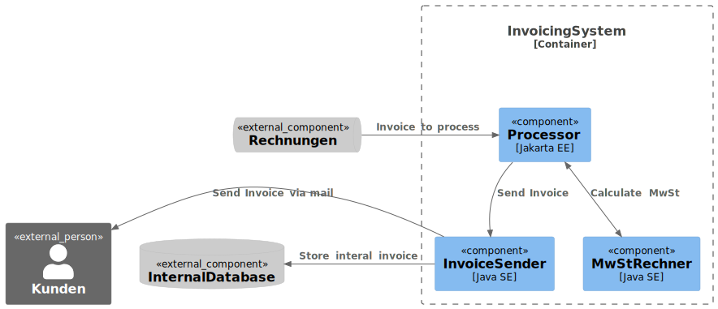

== Real World
image::images/standard-qualitaetssicherungskonzept-m.jpg[background,size=cover]

=== Testing
[source,java]
....
@Test
void invoiceValue100() {
  var customer = new Privatkunde("test", "test@dummy.de");

  var actualMwSt = MwStRechner.calculateMwSt(customer, 100d);

  assertThat(actualMwSt).isEqualTo(10d);
}
....

[%step]
--
6 Test to rule them all
--

[.notes]
--
These tests are pure Java SE with JUnit, no mocking or initializing a CDI Container.

Testing the Business Logic is now real fast and is hopefully executed more often.

This can of cause be perverted and is of cause possible with good OOP Style to some point.

But if you follow the guides and write atomic small Methods you end with such easy tests for the business logic.

Business, like in Enterprise Java? Yes no we get real.
--

=== Modules

[.notes]
--
But first modules.
Organize the modules as groups of data and connected logic.
Logic is fine to reuse, data is a different story, but the discussions are the same for _normal_ EE applications.
--

=== Integrate in EE

[source,java]
--
@Path("/invoice")
public class InvoiceResource {
  @Inject KundenRepository kundenRepo;
  @Inject MailService mailService;
  @GET
  public void sendInvoice(long kundeID, double wert) {
    var kunde = kundenRepo.findById(kundeID);
    var mwst = MwStRechner.calculateMwSt(kunde, wert);
    var text = InvoiceFormatter.
        produceInvoiceText(kunde, wert, mwst);
    mailService.sendMail(kunde, text);
  }
}
--

[.notes]
--
But we need to deploy a Resource or MDB for our customer, not a modul.

Here we see normal technical Jakarta EE calls like to Repository and Service.

The Kunde is loaded from the database and populated into the record.

This data is forwarded into the business logic to calculate the MwSt and format a Mail.

Later on it is handed back to EE Resources and is send as e-mail.

This code may need some happy path test with Testcontainer of Mocks, but the business logic can be tested very fast without an EE Container.

Same for Spring/Quarkus and other.
--
