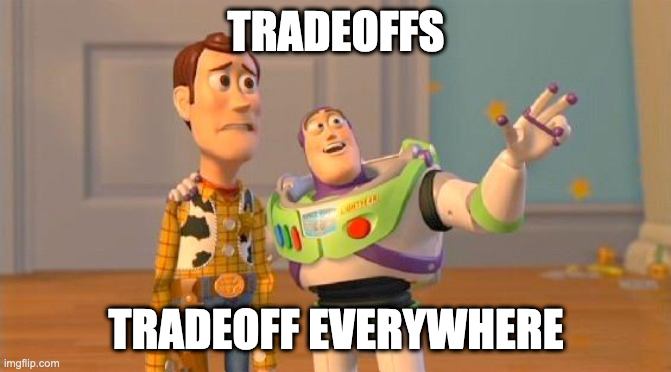
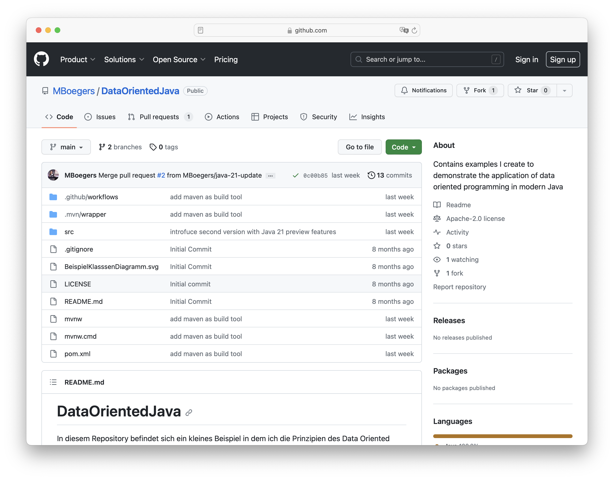

== Final Thoughts
image::images/collage-aus-wolkenfoermigen-koepfen.jpg[background,size=cover]

=== Make your own Opinion

=== Make your own Opinion
[%step]
* Readability 👓 - learn and use 📚
* Duplication 🖨️ - not always bad 🧀
* Testability ✅ - no brain needed 🧟‍
* Performance 🚴‍- don't guess, measure! ⏲️

=== Try it!

💻 https://github.com/MBoegers/DataOrientedJava[GitHub.com/MBoegers/DataOrientedJava]

📖 https://inside.java/2024/05/23/dop-v1-1-introduction[Data-Oriented Programming in Java]

// === Readability
// patterns are great
// switch is great
// big patterns get clumsy and messy

// === Duplication
// at the start feels like that
// get may contribute to readability
// contributes the no inference, if readability is needed -> new method based on inference

// === Performance
// "measure dont guess" - any performance expert

// === Testability
// huge plus
// easy to do with basics
// 100% is possible because of few to no edge cases
