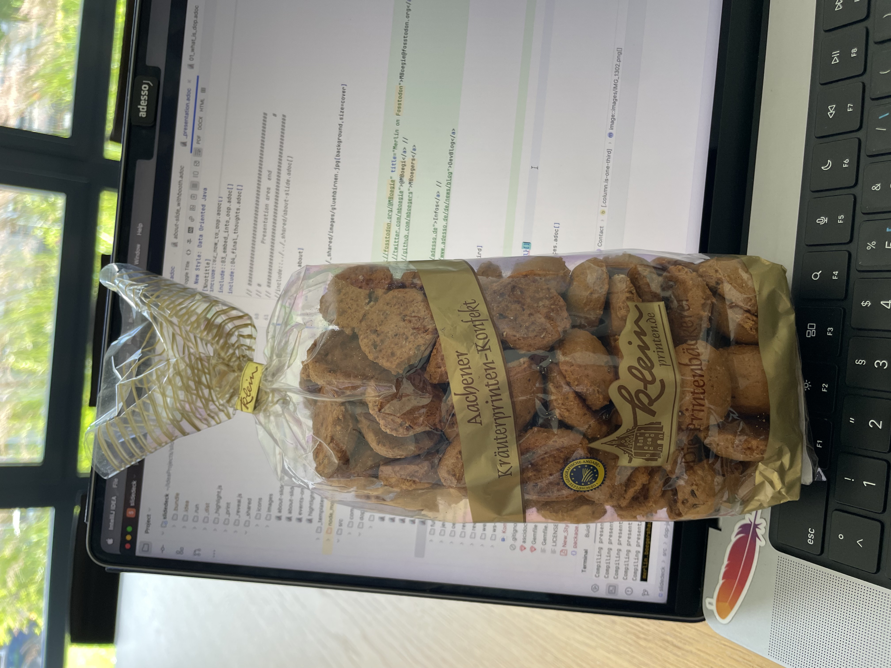

= New Style: Data Oriented Java
:backend: revealjs
:revealjs_theme: adesso
:revealjs_controls: false
:revealjs_controlsTutorial: false
:revealjs_progress: false
:revealjs_slideNumber: false
:revealjs_history: true
:revealjs_center: true
:revealjs_transition: fade
:revealjs_backgroundTransition: fade

:imagedir: images

:icons: image
:icontype: svg
:iconsdir: ../../_shared/icons

// Edit host information
:host-name: adesso Tech Day
:host-url: https://www.adesso.de/de/
:host-logo-style: logo
:host-logo-url: ../../_shared/images/adesso_logo_NoClaim.png
:host-twitter-url: https://twitter.com/SeAdesso
:host-twitter-name: @SeAdesso

include::../../_shared/hightlightjs.adoc[]
include::../../_shared/events-on-title-and-footer.adoc[]
// ####################################################
// #            Presentation area  start              #
// ####################################################

[.notes]
--
Hi I am Merlin, Enterprise Java Developer for more than 10 year.
I am with adesso for 2,5 year now in the role as senior software engineer and architect.
besides IT i am a Glider Instructor, Volleyball Setter and in love with the _new_ Java.
I always aime to help teams to modernize their applications and educate them in new Java and programming in general.
In this talk I'll show you Data Oriented Programming in Java with modern Language features.
If you wanne have something to educate your self i recommend this book and if you have questions just stop me, apporach me right after the talk, via social media.
But lets get startet.
--

[%notitle]
== Warning

{empty} +
{empty} +
{empty} +

Heavy use of preview features!

include::01_what_is_dop.adoc[]
include::02_how_to_dop.adoc[]
include::03_embed_into_oop.adoc[]
include::04_final_thoughts.adoc[]

// ####################################################
// #            Presentation area  end                #
// ####################################################
//include::../../_shared/about-slide.adoc[]

[.columns.about]
== Contact

[.column]
--
++++
<h3>Me</h3>
<a href="https://fosstodon.org/@MBoegie" title="Merlin on Fosstodon">🐘 MBoegie@fosstodon.org</a> // 
<a href="https://twitter.com/mboegie">𝚾</a> & <a href="https://bsky.app/profile/MBoegi.bsky.social">🦋</a> @MBoegi // 
GitHub/<a href="https://github.com/mboegers">MBoegers</a>
 
<h3>See you!</h3>
++++
--

[.column.is-one-third]
--

--

include::images/_sources.adoc[]
