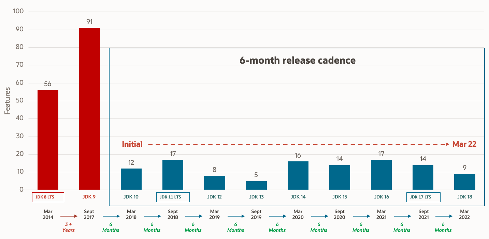

[.columns]
== Entry Poll

[.column]
--
image::images/umfrage.jpg[400,400]
--

[.column]
--

Mentimeter.com:

https://www.menti.com/aljvomg56fse[5520 4780]
--

=== Release Cycle

[cols="1,1,2,2"]
|===
|Version |GA 🎉 |Free 👍 |Extended 💶

|8
|2014
|Azul 2030
|Oracle 2030

|11
|2018
|Amazon 2027
|Azul 2026

|17
|2019
|Azul 2029
|Oracle 2029

|21
|2023
|2028
|Oracle 2031
|===

Mentimeter.com: https://www.menti.com/aljvomg56fse[5520 4780]

=== Feature pace

Mentimeter.com: https://www.menti.com/aljvomg56fse[5520 4780]

=== Results

++++

    <iframe allowfullscreen='true'
        allowtransparency='true'
        frameborder='0'
        height='315'
        sandbox='allow-scripts allow-same-origin allow-presentation'
        src='https://www.mentimeter.com/app/presentation/alti3kyif51q6dkkg5brvtw3g6ujikwd/embed'
        style='position: absolute; top: 0; left: 0; width: 100%; height: 100%;'
        width='420'></iframe>

++++
