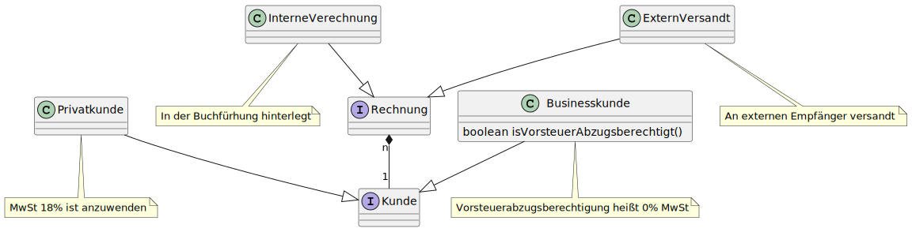

== The risky Part: Java 21

image::images/Plug_duke.png[400,400]

=== Targetted

* https://openjdk.org/jeps/431[Sequenced Collection 🎉]

[.notes]
--
* Collections that can be read backwards as well
--

=== Candidates

* https://openjdk.org/jeps/440[Finalization of Record Patterns] 🏁
* https://openjdk.org/jeps/441[Pattern Matching for Switch] 🏁
* https://openjdk.org/jeps/439[Generational ZGC] 🎉

[.notes]
--
* final steps towards Pattern Matching in Production
* Generation ZGC handles young instances that usually die young
--

=== Drafts

* https://openjdk.org/jeps/8304357[Scoped Values 🔬]
* https://openjdk.org/jeps/8303683[Virtual Threads 🏁]
* https://openjdk.org/jeps/8303167[Windows 32 Deprecation ⚠️]
* https://openjdk.org/jeps/8302326[Anonymous Main Class and enhanced Main Methode 🔬]

[.notes]
--
could be possible from the jep text * Scoped values into preview
--

=== How does it Look?

Sources: https://github.com/MBoegers/DataOrientedJava[github.com/MBoegers/DataOrientedJava]

[.notes]
--
An example used in my work shop under construction and articles
--

=== Domain Modeling

[source,java]
----
sealed interface Kunde permits Businesskunde, Privatkunde,
{ String name(); String mail(); }

record Privatkunde(String name, String mail)
  implements Kunde {}

record Businesskunde(String name, String mail,
  boolean isVorsteuerAbzugsberechtigt) implements Kunde {}
----

[.notes]
--
* We model possible types as different implementations of the interface abd records as the data carrier.
* Watch out, I use the method names (name,mail) matching the accessors ;-)
--

=== Flow Control

[source,java]
----
static double calculateMwSt(Kunde kunde, double wert) {
  return switch (kunde) {
    case Businesskunde b when b.isVorsteuerAbzugsberechtigt()
        -> 0.0d;
    case Businesskunde b -> wert * 0.18d;
    case Privatkunde p -> wert * 0.18d;
  };
}
----

[.notes]
--
Each Kunde is different and is handled at ONE point and not 3 different locations.
lead to more coherent logic.
No default because exaustive, otherwise compile error.
--

=== Deconstruction

[source,java]
----
switch (rechnung) {
  case InterneVerechnung(var abt, double wert) ->
    Dummy.storeInDB(abt, wert);
  case ExternVersandt(Kunde kunde, var wert) -> {
    double mwst = calculateMwSt(kunde, wert);
    var txt = formatMail(kunde.name(), wert, mwst);
    Dummy.sendViaMail(kunde.mail(), txt);
  }
}
----

[.notes]
--
avoid getter and use the values further down the road.
--

=== String interpolation

[source,java]
----
String mailText =  """
Hallo %s, Bitte senden Sie uns den Rechnungsbetrag in Höhe
von %.2f€ plus %.2f€ MwSt.

Mit freundlichen Grüßen
    Merlin Bögershausen
""".formatted(name, wert, mwst);
----

[.notes]
--
no real interpolation, that will be possible with String Templates, which may be previewed ;)
--

=== Concurrency

[source,java]
----
try (var executor = Executors.newVirtualThreadPerTaskExecutor()) {
  var future1 = executor.submit(() -> fetchURL(url1));
  var future2 = executor.submit(() -> fetchURL(url2));
  response.send(future1.get() + future2.get());
} catch (ExecutionException | InterruptedException e) {
  response.fail(e);
}
----

[.notes]
--
--
