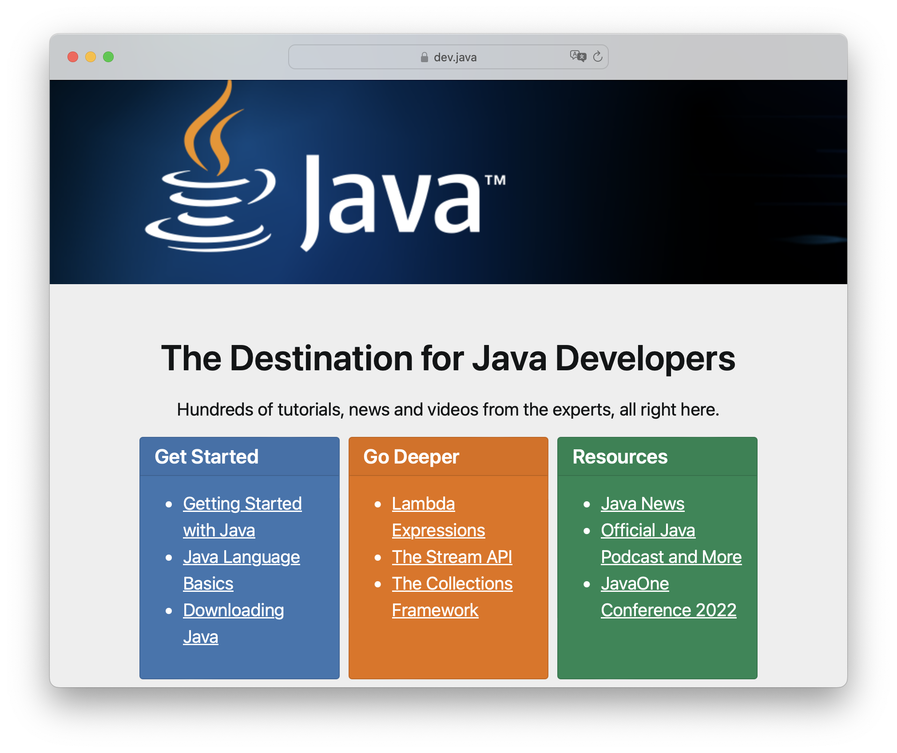

== Final Throughts

[.columns]
=== 10 Releases with 💯JEPs

[.column]
--

--

[.column]
--

--

[.columns]
=== Path into Future

[.column]
--
* https://inside.java/2023/03/09/data-oriented-programming/[Data oriented programming] inside Modules
* https://dev.java/learn/modules/[Modularization] in the Big
* Linea Programming, Concurrent Execution
* Cloud Enabling: https://wiki.openjdk.org/display/lilliput[Lilliput] and https://openjdk.org/projects/crac/[CRaC]
--

[.column.is-one-third]
--
image::images/CloudSurfDuke.png[]
--
