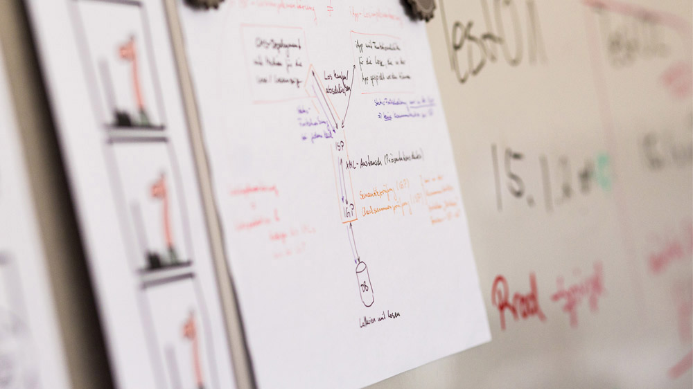

== Type Enhancements

=== JEP-359
*Records* landed in Java 16
[source, java]
----
record Range(int low, int high) {
  Range { <1>
    if (low > high)
      throw new IllegalArgumentException(/*...*/);
  }
  Range(int high) { this(0, high); } <2>
  int lenght() { return high - low; }
}
----
[.notes]
--
*Goals*: Enhance with transparent carriers for immutable data, Step towards pattern matching

*Motivation*: Simple aggregation of values, Focus on modelling immutable data, Auto implement data driven methods (equals, hashcode)

*Gotchas*: Are final, Can only implement sth,, Not only syntactic sugar

compact conical const <1>, Default constructor is conical
--

=== JEP-409
*Sealed Classes* landed in Java 17
[source, java]
----
sealed interface Shape {
  sealed class Cornered implements Shape {}
  non-sealed class Rectangle implements Cornered {}
  record Square(int h) implements Cornered {}
  final class Weirdo implements Shape {}
}
----
[.notes]
--
*Goals*: Add heritage control, Add exhaustiveness

*Motivation*: Give control to developers, Add access restrictions, Support pattern matching
--