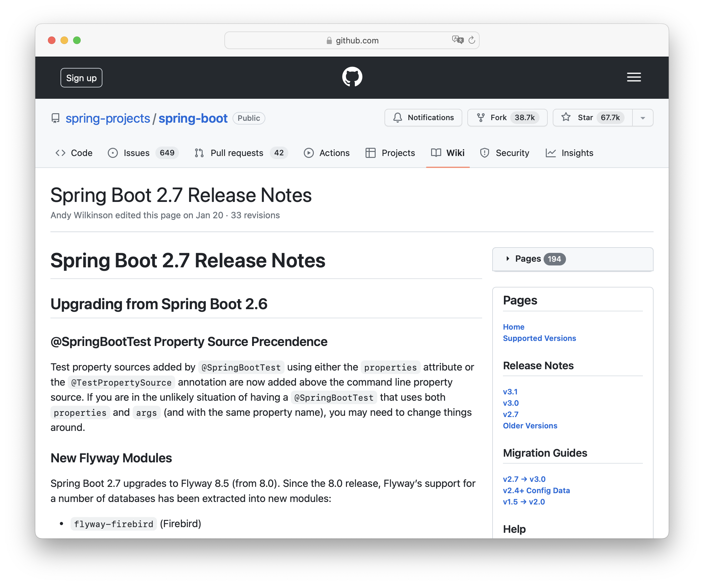
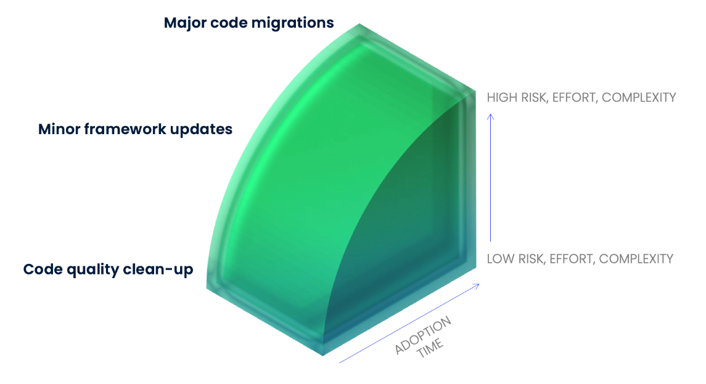

== Was ist Refactoring?

[quote,Fowler]
Refactoring is a controlled technique for *improving* the design of an *existing code* base.
Its essence is applying a series of small behavior-preserving transformations, *each* of which "*too small* to be worth doing".

[.notes]
--
Doch was sind Refactorings überhaupt?
Fragen wir Fowler!

* controlled technique; improve existing code; to small
* PO warum machen?
--

[.columns]
=== Multiline Strings

[.column]
--
Klassisch

[source,java]
....
String query =
  "SELECT * \n" +
  "FROM my_table\n" +
  "WHERE something = 1;";
....
--

[%step.column]
--
Java 15+

[source,java]
....
String query = """
  SELECT *
  FROM my_table
  WHERE something = 1;
  """;
....
--

[.notes]
--
* nur lesbarkeit und tool support, kein value
* aber daraus setzten sich upgrades zusammen ;)
--
=== JUnit Upgrade

++++
<table style="border: none">
<tr>
<td>
++++
image::images/junit4-logo.png[height=64]
++++
</td>
<td style="justify-content: center"> ➜ </td>
<td>
++++
image::images/junit5-logo.png[height=64]
++++
</td>
</tr>
</table>
++++

[source,java]
....
@Before /*->*/ @BeforeEach
@AfterClass /*->*/ @AfterAll
@Test(expected = IndexOutOfBoundsException.class)
  /*->*/ assertThrows(IndexOutOfBoundsException.class, () -> {})
Assert.assertEquals("One is one", 1, 1);
  /*->*/ Assertions.assertEquals(1, 1, "One is one");
@Test(timeout = 500) /*->*/ @Test @Timeout(500)
....

=== Framework Migration

See https://github.com/spring-projects/spring-boot/wiki/Spring-Boot-2.7-Release-Notes[Spring Boot 2.7 Release Notes]

[.notes]
--
Verbindungsdaten sind nun in _spring.artemis.broker-url_ kodiert.

Und hier werden auch Management Ebenen aktiv.
Das Kostet doch! Müsen wir das? Das ist aber kritisch!

stimmt auch alles.
--

[%notitle]
=== Migration Types

