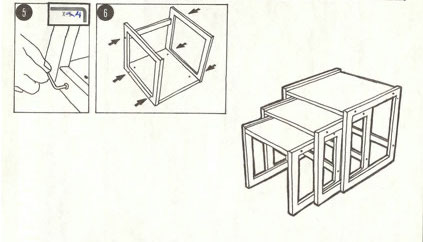
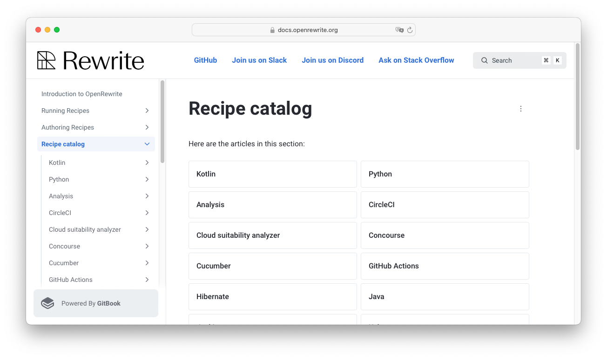

[%notitle.columns]
== Lösung: OpenRewrite

[.column.is-one-third]
image::images/61478321.png[.stretch]

[.column]
image::images/moderne_logo.avif[width=400]

//https://docs.openrewrite.org

[.notes]
--
* Automatisierung von kleinen Anpassungen
* Zusammenschluss zu großen Refactorings
* Wiederholbar und gleichförmig
* Unit tested und Open Source
--

[.columns]
=== Instruction
[.column]
--
image::images/Tune_Table_1980s_L.jpg[]
--

[.column]
--

--

[.notes]
--
Wiederholbar und gleichförmig werden Vorgehen, wenn es einen klaren Plan gibt.
Wie dieser von der Koenigin der verstaendlichen Plaene IKEA.

Wir finden ein paar Bretter und Schrauben, Schritt 1-6, ZACK Stapeltische!

Nur dass das Ikea-Wesen Open Rewrite ist und die Holzteile Code mit Semantik Formatierung.
--

=== Recipes
[source,java]
....
class T {
  java.util.List<String> list;
}
....

https://docs.openrewrite.org/recipes/java/shortenfullyqualifiedtypereferences[ShortenFullyQualifiedTypeReferences]

[source,java]
....
import java.util.List;
class T {
  List<String> list;
}
....

[.notes]
--
Open Rewrite nennt diese Instruction Recipes die aktiviert werden koennen.

Sie enthalten eine Reihe von Bedingungen und Anweisungen die auf gefundenen Code angewandt werden.

Das ist auch schon erstmal alles an Grundlagen die wir bisher kennen muessen.

Jetzt muss es nur noch starten
--

=== Refactor all in one

[source,bash]
....
mvn -U org.openrewrite.maven:rewrite-maven-plugin:run \
  -Drewrite.activeRecipes=org.openrewrite.java.\
    ShortenFullyQualifiedTypeReferences
....

[.step]
--
[source, shell]
....
rewrite-maven-plugin:5.20.0:run (default-cli) @ spring-petclinic
Using active recipe(s) [o.o.h.ShortenFullyQualifiedTypeReferences]
Using active styles(s) []
Validating active recipes...
Project [petclinic] Resolving Poms...
Project [petclinic] Parsing source files
Running recipe(s)...
Changes have been made to o/s/e/petclinic/vet/Vet.java by:
   o.o.j.ShortenFullyQualifiedTypeReferences
Please review and commit the results.
....
--

[.notes]
--
Open Rewrite laesst sich auf vielen Wegen zur ausfuehrung bringen.

Jede Variante hat seinen eigenen Anwendungsfall.

Maven und Gradle sind hier gleich maechtig.

Hier Nutzte ich den No-Changes-maven-way der eine einmalige ausfuerhung anstoesst.
--

=== Continuous Refactoring

Configure as part of your project

[source,xml]
....
<!-- project/build/plugins -->
<plugin>
  <groupId>org.openrewrite.maven</groupId>
  <artifactId>rewrite-maven-plugin</artifactId>
  <version>5.17.1</version> <!-- keep this up to date 😉 -->
  <configuration>
    <activeRecipes>
      <recipe>
  org.openrewrite.java.ShortenFullyQualifiedTypeReferences
      </recipe>
    </activeRecipes>
  </configuration>
</plugin>
....

[.notes]
--
Open Rewrite kann aber auch in den Build integriert werden um continuierliche anpassungen zu machen.

Bei diesem Recipe welche Namen einkuerzt sicher der bessere Weg.

Ueber diesen Weg kann Open Rewrite auch gut als Reviewer auf Code Style Ebene verwendet werden, aehnlich wie Formatter.

Beide gehht übrigens auch mit Gradle und für den Hard Core Refactor Dev gibt es noch die Moderne CLI (JavaLand)
--

== Recipes Catalog
//https://docs.openrewrite.org/recipes[Recipe Katalog]

[.notes]
--
Weitere Recipes kann man sich ganz einfach aus den Docs holen.

Die Dokumentation der Recipes ist automatisiert also kann jedes Recipe verwendet werden das ihr findet.

Achtung bei einigen werden weitere Open Rewrite Artefakte benoetigt.
--
