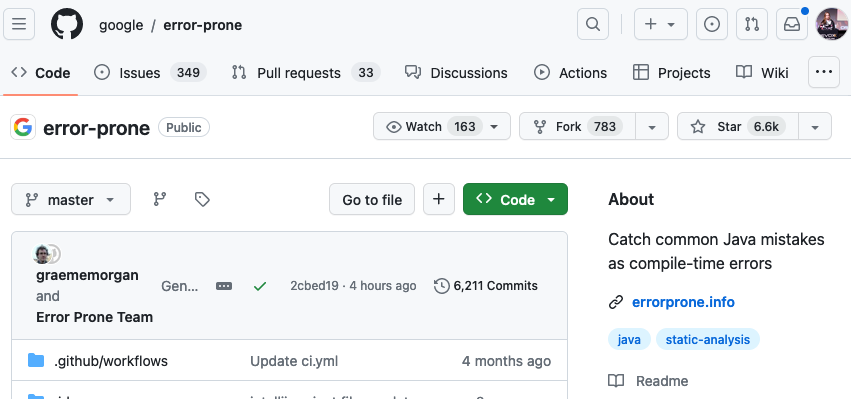

== Write your own

[.notes]
--
Jetzt möchte ich euch no zeigen welche Möglichkeiten es gibt eigene Refactorings zu definieren.
Wir können ihr nicht ganz tief einsteigen aber es wird als Vorgeschmack für die JavaLand funktionieren.
--

[.columns]
=== Declarative

[.column]
--

--

[.column]
--
If it can be *declarative*,

do it *declarative*!
--

[.notes]
--
Open Rewrite hat eine riesige Sammlung an vorhandenen Recipes.

Viele von denen sind generisch wie AddDependency, AddAnnotation.

Ein Beispiel aus der Enterprise Welt wo wir Declarative Rezepte einsetzten koennen
--

=== Declarative Example

[source, java]
....
class SomeCallee {
  @java.lang.SuppressWarnings("deprecation") // 🤡
  void doIllegalStuff() {
    someService.oldOperation(); // ok..
  }
}

class SomeService {
  @java.lang.Deprecated
  void oldOperation(){/*..*/}
}
....

//[%step]
//--
//Remove SuppressWarnings to generate compile time warnings
//--

[.notes]
--
Wie Provisorien lebt auch Deprecated code fuer immer.

Hier haben wir eine Deorecated API SomeService#oldOperation.
Irgendwer hat es benutzt und weil es nervte oder IntelliJ es angeboten hat die Warning unterdrückt.

Passiert aber wir haben keine Warning und common wenn wir mist machen dann lass uns auch dazu stehen.
Wir wollen die Supression entfernen, aber jetzt überall.
Also STRG+R Supression such und erstezten fühlt sich komisch an.
--

=== Remove Suppressions
[source,yaml]
....
---
type: specs.openrewrite.org/v1beta/recipe
name: io.github.mboegers.RemoveDeprecationSuppression
displayName: Remove SuppressWarnings for deprecation
recipeList:
  - org.openrewrite.java.RemoveAnnotation:
      annotationPattern: \
        '@java.lang.SuppressWarnings("deprecation")'
....

[.notes]
--
Ihr werdet es nicht glauben, es gibt da etwas von Open Rewrite.

Das allgemeine RemoveAnnotation Rezept.
Dieses Rezept benötigt konfiguration und kann dann ausgeführt werden.
Das Pattern ist angelehnt bzw. gleich zu AspectJ.

Weitere Konfiguration fast klar.
--

=== Result after execution

[source, java]
....
class SomeCallee {
  void doIllegalStuff() {
     someService.oldOperation();
  }
}

class SomeService { /*...*/ }
....

[source, bash]
....
Note: Some input files use or override a deprecated API.
Note: Recompile with -Xlint:deprecation for details.`
....

=== Refaster

//Projektseite: https://errorprone.info/[ErrorProne.info]

[.notes]
--
Error Prone ist eine Statish Code Analyse von Google die auch Refactorings kann.
Error Prone nutzt dafür Refaster, es erlaubt Methodenaufrufe zu ersetzten.

Diese Schnittstelle implementiert Open Rewrite auch, besonders hilfreich wenn man nur aufrufe wechseln will
--

=== Refaster Example

[source, java]
....
class SomeCallee {
  void doIllegalStuff() {
    someService.oldOperation(); // ⚠️
  }
}

class SomeService {
  @java.lang.Deprecated
  void oldOperation(){/*..*/}
  void betterOperation(){/*..*/}
}
....

//[%step]
//--
//switch from `oldOperation` to `newOperation`
//--

[.notes]
--
Wir machen weiter an unserem Beispiel. Diesmal wollen wir die Methoden austauschen.

und dafür schreiben wir ein Refaster Recipe welches oldOperation gegen newOperation austauscht
--

=== Refaster Recipe

[source, java]
....
@RecipeDescriptor(
  name = "Replace oldOperation with betterOperation",
  description = "Replace deprecated ´oldOperation´ " +
                "with surrogate ´betterOperation´")
public static class ReplaceOldOperation {
  @BeforeTemplate
  public void oldOperation(SomeService s) {
    s.oldOperation();
  }
  @AfterTemplate
  public void newOperation(SomeService s) {
    s.betterOperation();
  }
}
....

[.notes]
--
Diesmal als Java Klasse mit Annotations für die namen usqw.

Wichtig ist hier Before und After, es gibt auch alternative
--

=== Refaster Result

[source, java]
....
class SomeCallee {
  void doIllegalStuff() {
    someService.betterOperation(); // 👌
  }
}

class SomeService {
  @java.lang.Deprecated
  void oldOperation(){/*..*/}
  void betterOperation(){/*..*/}
}
....
