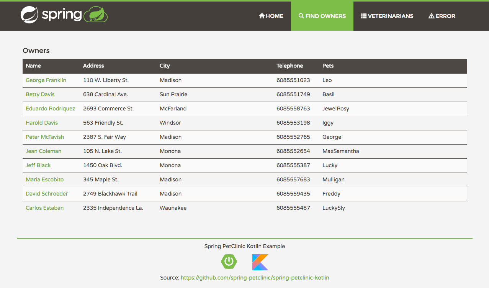
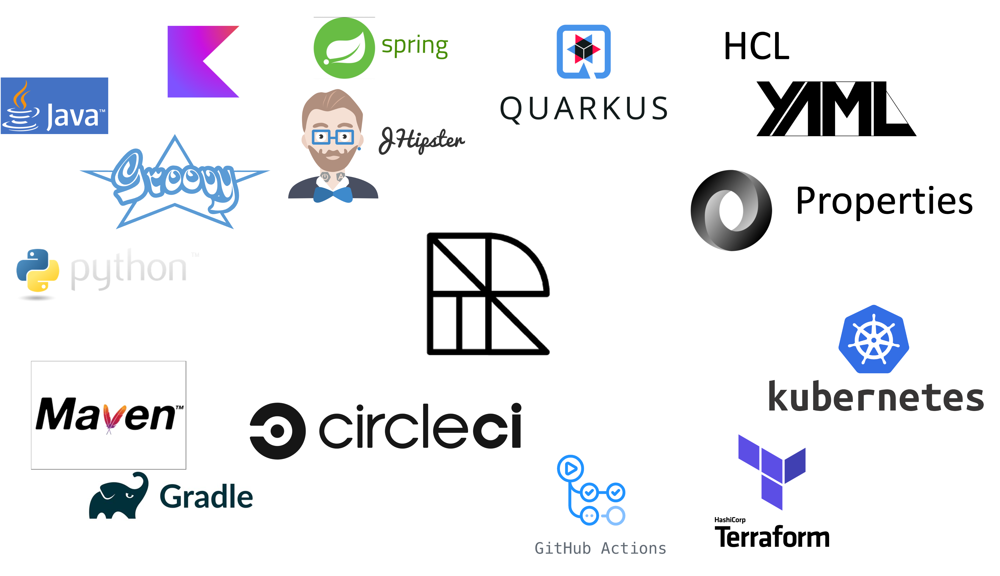

= OpenRewrite: Automated Refactorings
:backend: revealjs
:revealjs_theme: adesso
:revealjs_controls: false
:revealjs_controlsTutorial: false
:revealjs_progress: false
:revealjs_slideNumber: false
:revealjs_history: true
:revealjs_center: true
:revealjs_transition: fade
:revealjs_backgroundTransition: fade

:imagedir: images

:icons: image
:icontype: svg
:iconsdir: ../../_shared/icons

// Edit host information
:host-name: Architekturzirkel
:host-url: https://www.adesso.de
:host-logo-style: logo
:host-logo-url: ../../_shared/images/adesso_logo_NoClaim.png
:host-twitter-url: https://twitter.com/adesso_se
:host-twitter-name: @adesso_SE

include::../../_shared/hightlightjs.adoc[]
include::../../_shared/events-on-title-and-footer.adoc[]
// ####################################################
// #            Presentation area  start              #
// ####################################################

== Was ist Refactoring?

[quote,Fowler]
Refactoring is a controlled technique for *improving* the design of an *existing code* base.
Its essence is applying a series of small behavior-preserving transformations, *each* of which "*too small* to be worth doing".

[.notes]
--
* controlled technique; improve existing code; to small
* PO warum machen?
--

[.columns]
=== Multiline Strings

[.column]
--
Klassisch

[source,java]
....
String query =
  "SELECT * FROM\n" +
  "my_table\n" +
  "WHERE something = 1;";
....
--

[%step.column]
--
Java 15+

[source,java]
....
String query = """
  SELECT * FROM
  my_table
  WHERE something = 1;\
  """;
....
--

[.notes]
--
* nur lesbarkeit und tool support, kein value
* aber daraus setzten sich upgrades zusammen ;)
--

=== Framework Migration

image::images/sping-boot-27-migration-guide.png[Spring Boot 2.7 Migration Guide,400,350]

See https://github.com/spring-projects/spring-boot/wiki/Spring-Boot-2.7-Release-Notes[Spring Boot 2.7 Release Notes]

[.notes]
--
Verbindungsdaten sind nun in _spring.artemis.broker-url_ kodiert.
--

=== Migration Types

image::images/Komplexitaet_verteiling.webp[]

== Lösung: OpenRewrite

image::images/61478321.png[Open Rewrite Logo]

https://docs.openrewrite.org

[.notes]
--
* Automatisierung von kleinen Anpassungen
* Zusammenschluss zu großen Refactorings
* Wiederholbar und gleichförmig
--

=== Let's dive in!

Upgrade Spring Boot 2.7 to 3.0 in https://spring-petclinic.github.io/[Spring Pet Clinic]

[.notes]
--
* Wir springen jetzt in eine Demo.
* Während er Migration schauen wir auf die Möglichkeiten
--

=== Configure Plugin

Auch für Gradle und ohne Modifikationen, siehe https://docs.openrewrite.org/running-recipes[Getting Started]

[source,bash]
mvn -U org.openrewrite.maven:rewrite-maven-plugin:run

[%step]
--
[source,xml]
....
<plugin>
  <groupId>org.openrewrite.maven</groupId>
  <artifactId>rewrite-maven-plugin</artifactId>
  <version>4.45.0</version>
</plugin>
....
--

=== Activate Recipe

Komplette Liste verfügbar im https://docs.openrewrite.org/recipes[Recipe Katalog]

[source,bash]
-Drewrite.activeRecipes=\
 org.openrewrite.java.RemoveUnusedImports

[%step]
--
[source,xml]
....
<configuration>
  <activeRecipes>
    <recipe>
      org.openrewrite.java.spring.boot3.UpgradeSpringBoot_3_0
    </recipe>
  </activeRecipes>
</configuration>
....
--

=== Refactor!

[source,bash]
....
./mvnw rewrite:run
....

[%step]
--
[source,bash]
....
Changes have been made to .github/workflows/maven-build.yml by:
 org.openrewrite.java.spring.boot3.UpgradeSpringBoot_3_0
  org.openrewrite.java.spring.boot3.MavenPomUpgrade
   org.openrewrite.java.migrate.JavaVersion17
    org.openrewrite.java.migrate.UpgradeJavaVersion:
      {version=17}
  org.openrewrite.java.migrate.UpgradeToJava17
   org.openrewrite.github.SetupJavaUpgradeJavaVersion
....
--

=== LST

Sicht auf die Dinge, der https://docs.openrewrite.org/concepts-explanations/lossless-semantic-trees[Lossless Semantic Tree]

[source,java]
....
class A {
  void test() {
    int a;
    a = 0;
  }
}
....

[%step]
--
[source,bash]
....
-J.CompilationUnit
 \-J.ClassDeclaration
   |-J.Identifier | "A"
   \-J.Block
     \-J.MethodDeclaration | "MethodDeclaration{A{name=test,return=void,parameters=[]}}"
       |---J.Primitive | "void"
       |---J.Identifier | "test"
....
--

=== Recipe

Ausführbare Einheit in OpenRewrite, ein https://docs.openrewrite.org/concepts-explanations/recipes[Recipe]

[source,java]
....
public class MakePublic extends Recipe {
  @Override
  protected JavaVisitor<ExecutionContext> getVisitor() {
    return new ChangeTypeVisitor();
  }
  public String getDisplayName() {
    return "Make Class Public";
  }
  private class MakePublicVisitor
    extends JavaVisitor<ExecutionContext> {}
}
....

=== Visitor

Bearbeite den LST mit https://docs.openrewrite.org/concepts-explanations/visitors[Visitor]s

[source,java]
....
class JavaVisitor
 extends TreeVisitor<J, P> {
  J visitStatement(Statement statement) {}
  J visitAnnotatedType(J.AnnotatedType annotatedType)  {}
  J visitAnnotation(J.Annotation annotation) {}
  J visitAssert(J.Assert azzert) {}
  J visitAssignment(J.Assignment assign) {}
  J visitAssignmentOperation(J.AssignmentOperation assignOp) {}
  //...
}
....

=== Visitor Implementation

[source,java]
....
new JavaIsoVisitor<ExecutionContext> {
  public J.ClassDeclaration visitClassDeclaration(
          J.ClassDeclaration cd, ExecutionContext ctx) {
    cd = super.visitClassDeclaration(cd, ctx);
    List<J.Modifier> modifiers = cd.getModifiers();
    modifiers.removeIf(
            m -> J.Modifier.Type.Private.equals(m.getType()));
    // and Protected & Public
    modifiers.add(PUBLIC_MODIFIER);
    return cd.withModifiers(modifiers);
  }
}
....

=== Declarative YAML

Wenn es https://docs.openrewrite.org/reference/yaml-format-reference[declarative] geht, mach es deklarativ

[source,yaml]
....
---
type: specs.openrewrite.org/v1beta/recipe
name: io.github.mboegers.rewrite.MakePublic
displayName: Change method access level to public
recipeList:
  - org.openrewrite.java.ChangeMethodAccessLevel:
      methodPattern: *
      newAccessLevel: public
      matchOverrides: null
....

=== Styles

[source,yaml]
....
type: specs.openrewrite.org/v1beta/style
name: io.moderne.spring.style
styleConfigs:
  - org.openrewrite.java.style.NeedBracesStyle:
      allowSingleLineStatement: false
      allowEmptyLoopBody: true
....

[%step]
--
[source,java]
....
for(int i = 0; i < 10; i++);
if(success()) return false;
....
--

[%step]
--
[source,java]
....
for(int i = 0; i < 10; i++);
if(success()){
    return false;
}
....
--

== Takeaways

=== Abilities

=== When?

* Vereinheitlichung bei unterschiedlichen Adaptionsniveaus 🧐
* Modernisierung bei Major Updates 🤢
* Sonar Qube Silencer 🙃

[.notes]
--
* List.of() wird nicht verwendet
* Spring Framework
--

=== https://public.moderne.io[Moderne] UI

image:images/moderne_ui_screenshot.png[height=400px]

=== Future

* Basic JavaScript Support in 8.0.0 🥳
* Var Usage Recipe(s) 🤹‍
* C# denkbar 😉

[%notitle]
== Interaction

//image::../../_shared/images/adesso_Fotos/Bilder_PPT_InteractionRoom I.jpg[background]
image:../../_shared/images/adesso_Fotos/Bilder_PPT_InteractionRoom I.jpg[.stretch]

// ####################################################
// #            Presentation area  end                #
// ####################################################
include::images/_sources.adoc[]
