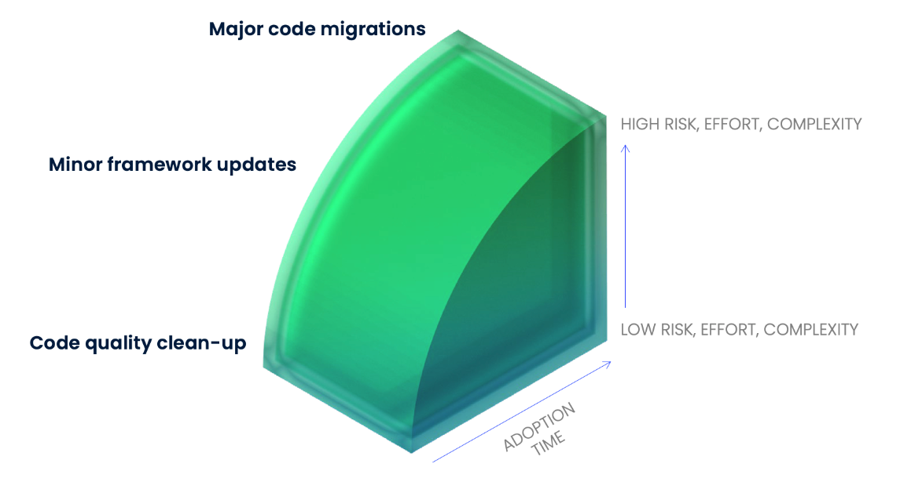

= OpenRewrite: Automated Refactorings
:backend: revealjs
:revealjs_theme: adesso
:revealjs_controls: false
:revealjs_controlsTutorial: false
:revealjs_progress: false
:revealjs_slideNumber: false
:revealjs_history: true
:revealjs_center: true
:revealjs_transition: fade
:revealjs_backgroundTransition: fade

:imagedir: images

:icons: image
:icontype: svg
:iconsdir: ../../_shared/icons

// Edit host information
:host-name: Java Usergroup Hamburg
:host-url: https://www.meetup.com/jug-hamburg/
:host-logo-style: logo
:host-logo-url: ../../_shared/images/hosts/jughh_duke.png
:host-twitter-url: https://twitter.com/jughh
:host-twitter-name: @jughh

include::../../_shared/hightlightjs.adoc[]
include::../../_shared/events-on-title-and-footer.adoc[]
// ####################################################
// #            Presentation area  start              #
// ####################################################

== Was ist Refactoring?

[quote,Fowler]
Refactoring is a controlled technique for *improving* the design of an *existing code* base.
Its essence is applying a series of small behavior-preserving transformations, *each* of which "*too small* to be worth doing".

[.notes]
--
* controlled technique; improve existing code; to small
* PO warum machen?
--

[.columns]
=== Multiline Strings

[.column]
--
Klassisch

[source,java]
....
String query =
  "SELECT * FROM\n" +
  "my_table\n" +
  "WHERE something = 1;";
....
--

[%step.column]
--
Java 15+

[source,java]
....
String query = """
  SELECT * FROM
  my_table
  WHERE something = 1;\
  """;
....
--

[.notes]
--
* nur lesbarkeit und tool support, kein value
* und ab Java 21 schon wieder outdated..
* aber daraus setzten sich upgrades zusammen ;)

apropos Updates!
--

=== Framework Migration

image::images/sping-boot-27-migration-guide.png[Spring Boot 2.7 Migration Guide,400,350]

See https://github.com/spring-projects/spring-boot/wiki/Spring-Boot-2.7-Release-Notes[Spring Boot 2.7 Release Notes]

[.notes]
--
* Verbindungsdaten sind nun in _spring.artemis.broker-url_ kodiert
* geht mit Boot 3 in nächste Runde
* dann auch zwingend Java 17

Also gibt es spannen?
--

=== Migration Types

[.notes]
--
* Zeit vs. Complexity therefore risk
* unten MultilineStrings
* Spring Boot 2.6 zu 2.7
* Major Migrations Boot 3, JEE to Spring

Wir haben gesehen, es gibt vers. Größenordnungen und oft setzten sich große aus kleinen zusammen
--

=== Migration Types

== Lösung: OpenRewrite

image::images/61478321.png[Open Rewrite Logo]

//https://docs.openrewrite.org

[.notes]
--
* Automatisierung von kleinen Anpassungen
* Zusammenschluss zu großen Refactorings
* Wiederholbar und gleichförmig
--

=== Let's dive in!

//Upgrade Spring Boot 2.7 to 3.0 in https://spring-petclinic.github.io/[Spring Pet Clinic]
image:images/springbootpetclinic.png[Screenshot,630,370]

[.notes]
--
* Wir springen jetzt in eine Demo.
* Während er Migration schauen wir auf die Möglichkeiten
--

=== Configure Plugin

//Auch für Gradle und ohne Modifikationen, siehe https://docs.openrewrite.org/running-recipes[Getting Started]

[source,bash]
mvn -U org.openrewrite.maven:rewrite-maven-plugin:run

[%step]
--
[source,xml]
....
<plugin>
  <groupId>org.openrewrite.maven</groupId>
  <artifactId>rewrite-maven-plugin</artifactId>
  <version>4.45.0</version>
</plugin>
....
--

[.notes]
--
* Per Maven CLI
* Gradle / maven config
--

=== Activate Recipe

//Komplette Liste verfügbar im https://docs.openrewrite.org/recipes[Recipe Katalog]
siehe https://docs.openrewrite.org/recipes[openrewrite.org: Recipe Katalog]

[source,bash]
-Drewrite.activeRecipes=\
 org.openrewrite.java.RemoveUnusedImports

[%step]
--
[source,xml]
....
<configuration>
  <activeRecipes>
    <recipe>
      org.openrewrite.java.RemoveUnusedImports
    </recipe>
  </activeRecipes>
</configuration>
....
--

=== Refactor!

[source,bash]
....
./mvnw rewrite:run
....

[%step]
--
[source,bash]
....
Changes have been made to .github/workflows/maven-build.yml by:
 org.openrewrite.java.spring.boot3.UpgradeSpringBoot_3_0
  org.openrewrite.java.spring.boot3.MavenPomUpgrade
   org.openrewrite.java.migrate.JavaVersion17
    org.openrewrite.java.migrate.UpgradeJavaVersion:
      {version=17}
  org.openrewrite.java.migrate.UpgradeToJava17
   org.openrewrite.github.SetupJavaUpgradeJavaVersion
....
--

=== LST

der https://docs.openrewrite.org/concepts-explanations/lossless-semantic-trees[Lossless Semantic Tree]

[source,java]
....
// 0
class A { // 1
  void test() {
    int a;
    a = 0;
  }
}
....

[%step]
--
[source,bash]
....
-J.CompilationUnit // 0
 \-J.ClassDeclaration // 1 - start
   |-J.Identifier | "A"
   \-J.Block // 1 - end
     \-J.MethodDeclaration | "MethodDeclaration{A{name=test,return=void,parameters=[]}}"
....
--

[.notes]
--
* Verlustfreier semantischer Baum kein Abstract Syntax Tree
* nicht nur syntax für interpreter
* semantik & format wird auch transportier

als Ergebnis kein diff im Git
--

=== Recipe

https://docs.openrewrite.org/concepts-explanations/recipes[Recipe] ein ausführbares Refactoring

[source,java]
....
public class MakePublic extends Recipe {
  @Override
  protected JavaVisitor<ExecutionContext> getVisitor() {
    return new MakePublicVisitor(); // 1
  }
  public String getDisplayName() {
    return "Change class visibility to public 🤡";
  }
  private class MakePublicVisitor
    extends JavaVisitor<ExecutionContext> {}
}
....

[.notes]
--
* möglichst atomar
* von compilierbar zu compilierbar
* never break philisophy
--

=== Visitor

Bearbeite den LST mit https://docs.openrewrite.org/concepts-explanations/visitors[Visitor]s

[source,java]
....
class JavaVisitor
 extends TreeVisitor<J, P> {
  J visitStatement(Statement statement) {}
  J visitAnnotatedType(J.AnnotatedType annotatedType)  {}
  J visitAnnotation(J.Annotation annotation) {}
  J visitAssert(J.Assert azzert) {}
  J visitAssignment(J.Assignment assign) {}
  J visitAssignmentOperation(J.AssignmentOperation assignOp) {}
  //...
}
....

[.notes]
--
* für jeden Knoten im LST gibt es eine Methode
* liefert ergenis auch als J.*
--

=== Visitor Implementation

[source,java]
....
new JavaIsoVisitor<ExecutionContext> {
  public J.ClassDeclaration visitClassDeclaration(
          J.ClassDeclaration cd, ExecutionContext ctx) { // 1
    cd = super.visitClassDeclaration(cd, ctx);
    List<J.Modifier> modifiers = cd.getModifiers(); // 2
    modifiers.removeIf( //2
            m -> J.Modifier.Type.Private.equals(m.getType()));
    // and Protected & Publicπ
    modifiers.add(PUBLIC_MODIFIER); // 3
    return cd.withModifiers(modifiers); // 4
  }
}
....

[.notes]
--
sieht wirr aus, wir gehen durch

1. wir bearbeiten jede Klassen Declaration, auch inner classes
2. hole aktuelle modifier
3. lösche all die private, protected sind

--

=== Declarative YAML

Be https://docs.openrewrite.org/reference/yaml-format-reference[declarative]!

[source,yaml]
....
---
type: specs.openrewrite.org/v1beta/recipe
name: io.github.mboegers.rewrite.MakePublic
displayName: Change method access level to public
recipeList:
  - org.openrewrite.java.ChangeMethodAccessLevel:
      methodPattern: *
      newAccessLevel: public
      matchOverrides: null
....

[.notes]
--
hier greife ich auf eine vorbereitetes Reciepe zu um methoden public zu machen

https://docs.openrewrite.org/recipes/java/changemethodaccesslevel
--

=== Styles

[source,yaml]
....
type: specs.openrewrite.org/v1beta/style
name: io.moderne.spring.style
styleConfigs:
  - org.openrewrite.java.style.NeedBracesStyle:
      allowSingleLineStatement: false
      allowEmptyLoopBody: true
....

[%step]
--
[source,java]
....
for(int i = 0; i < 10; i++);
if(success()) return false;
....
--

[%step]
--
[source,java]
....
for(int i = 0; i < 10; i++);
if(success()){
    return false;
}
....
--

[.notes]
--
Formate sind dann wichtig wenn unkonventionelle Vereinbarungen gelten.
Es gibt viele vorbereitete leder (noch) kein Katalog dazu, evtl. einfacher über IDE/Formatter

https://docs.openrewrite.org/recipes/java/changemethodaccesslevel
--

== Takeaways

image:../../_shared/images/adesso_Fotos/Bilder_PPT_Notizbuch.jpg[600,447]

[.notes]
--
* code semantisch korrekt parsen, quasi lesen
* atomare Refactorings definieren in Java
* declarativ zu komplexen Migrations kombinieren (siehe Quarkus & Spring Boot)
* das ganze reprodizierbar und in einem Bruchteil der Zeit

Meine Manager/PO/PL wie auch immer sie bei euch heißen, Entscheider, schalten am Terminal ab.
--

=== Moderne.io

image::images/moderne_ui_screenshot.png[700,700]

[.notes]
--
* Frei für open Source Projekte auf GitHub
* on Prem möglich
* klicki bunti auf Spring updaten oder Methoden Public machen
* Pull Requests direkt erstellen
* auch on Prem möglich

Aber Merlin das ist doch alles nur Java - nope
--

=== Abilities

image::images/powerOfRewrite.png[background=white,600,347]

[.notes]
--
Ich finde hier vieles mit dem ich Arbeite!
Was vermisst ihr? lasst es uns anregen
--

[%notitle]
== Danke

image:../../_shared/images/Abschied_Coole_Leute.jpeg[.stretch]

[%notitle]
== Interaction

image:../../_shared/images/adesso_Fotos/Bilder_PPT_InteractionRoom I.jpg[.stretch]

// ####################################################
// #            Presentation area  end                #
// ####################################################
include::images/_sources.adoc[]
