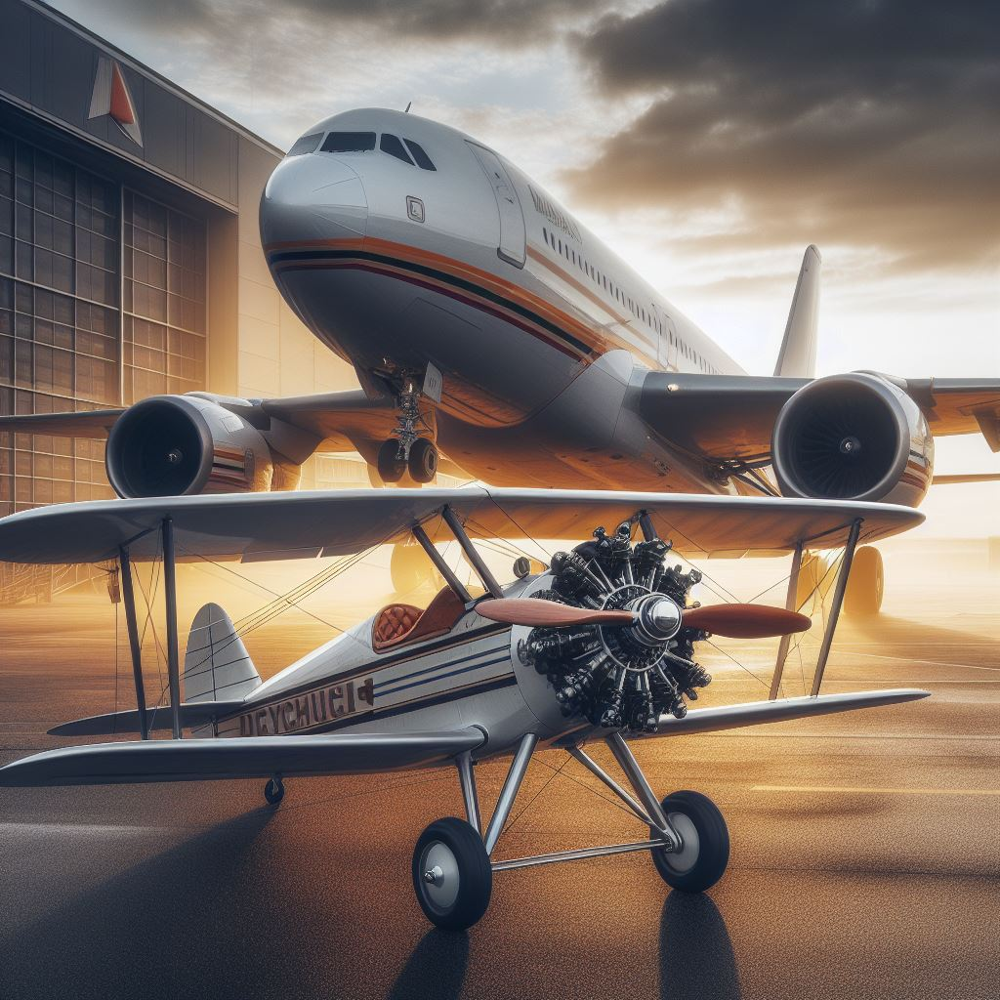
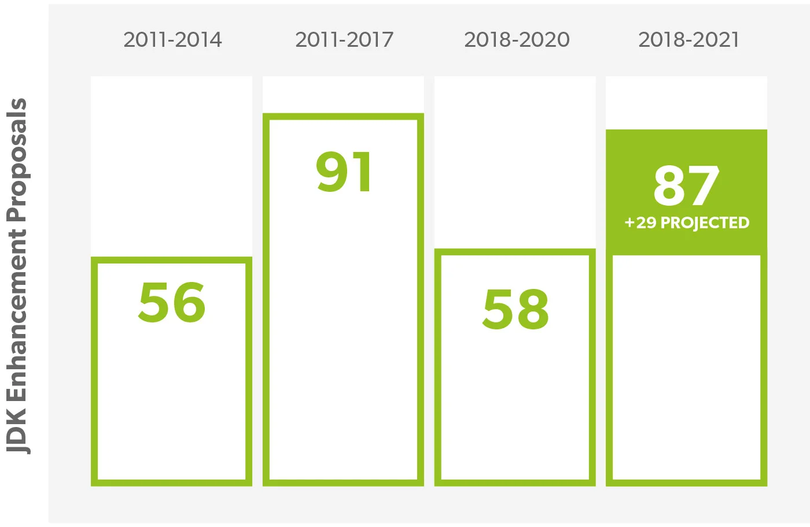
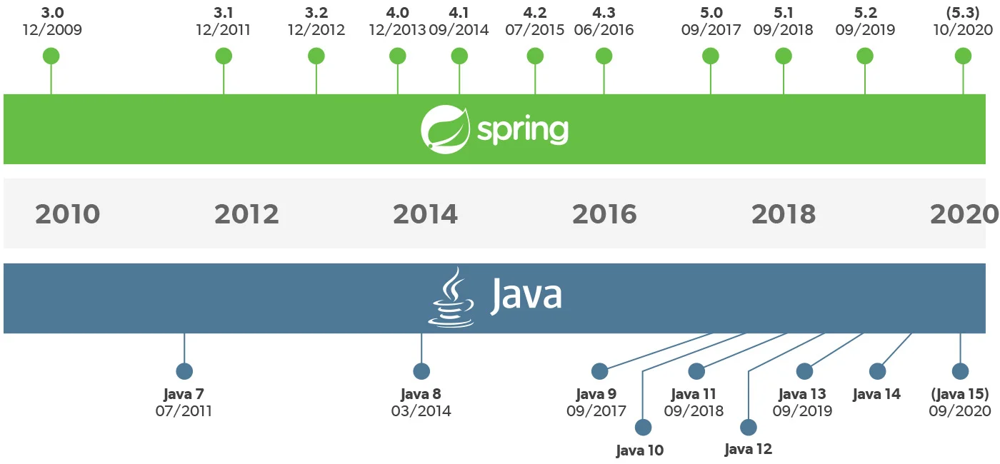

== Why modernization?

[.notes]
--
Why you we ever evoled this classic plane to this modern one?

It had everything! Okay I am pilot, i am biased.

Time files and technology envoled, this enabled less fule per head, less major incidents and faster travels.
--

=== JEPs over Time

[.notes]
--
JEPs are JDK Enhancement Proposals. each of them contain a proposed change to the JDK.
Lots of them are new Language features which make it easier to do thinks.
And the other 2/3 are deprications, performance or security improvements.
--

=== Evolution of Java

[.notes]
--
And it getting worse! here we have the timeline of Java Releases and Spring Releases.
At least Java is denser now and with this higher rate of releases the ecosystem picks up a new pace!
--

=== Act now!

[.notes]
--
I hope that you are now with me that you need to modernize and should keep mondernizing in smaller steps.
Because the aircraft industie took multiple steps from the Doppeldecker to Airbus.
--
