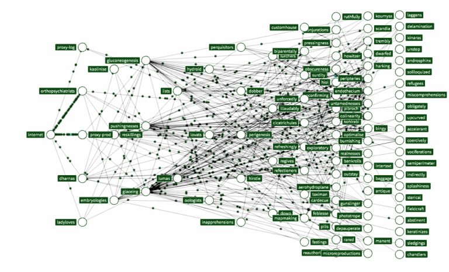

== How modernizations work?
image::images/student-posiert-im-klassenzimmer.jpg[background,size=cover]

[.notes]
--
We need to refactor small parts again and again to move twoards our goal.
Lets see what Refactorings are and how we can make use of them
--

=== Refactorings

[quote,Fowler]
Refactoring is a controlled technique for *improving* the design of an *existing code* base.
Its essence is applying a series of small behavior-preserving transformations, *each* of which "*too small* to be worth doing".

=== Just another Method

=== Just a new version
++++
<table style="border: none">
<tr>
<td>
++++

++++
</td>
<td style="justify-content: center"> ➜ </td>
<td>
++++
image::images/junit5-logo.png[height=64]
++++
</td>
</tr>
</table>
++++

[%step]
--
[source,java]
....
@Before /*->*/ @BeforeEach
@AfterClass /*->*/ @AfterAll
@Test(expected = IndexOutOfBoundsException.class)
  /*->*/ assertThrows(IndexOutOfBoundsException.class, () -> {})
Assert.assertEquals("One is one", 1, 1);
  /*->*/ Assertions.assertEquals(1, 1, "One is one");
@Test(timeout = 500) /*->*/ @Test @Timeout(500)
....
--

[.columns]
=== Check Please!

[.column]
--

[%step]
Setup Annotations
30 min each

[%step]
Timeouts
10 min/use

[%step]
Expected Exceptions
10 min/use

[%step]
times the hourly rate

[%step]
😳😳
--

[.column]
--

--

=== Repeat on next

[.notes]
--
This is the traffic flow of netflix, but it illustrates how ofthe this process have to be repeated.
Thsi simply doens scale.

But we leaned a new technique a few 10 years ago, automation!
We have to spent money on automation to save only on the long run!
Its like CI/CD but with modernization, and for the we need a tool like open Rewrite.
--
