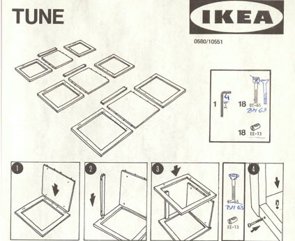
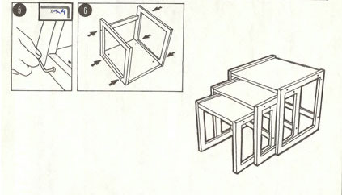

[%notitle.columns]
== What is Open Rewrite?

++++
<table style="border: none">
    <tr>
    <td>
++++
image::images/61478321.png[.stretch]
++++
    </td>
    <td>
++++
image::images/moderne_logo.avif[width=400]
++++
    </td>
    </tr>
    <tr>
    <td>
++++

++++
    </td>
    <td style="vertical-align: middle">
++++
Commonhaus Foundation

https://www.commonhaus.org/
++++
    </td>
    </tr>
</table>
++++

[.notes]
--
* Automatisierung von kleinen Anpassungen
* Zusammenschluss zu großen Refactorings
* Wiederholbar und gleichförmig
* Unit tested und Open Source
--

[.columns]
=== Instruction
[.column]
--

--

[.column]
--

--

=== Moderne / Open Rewrite

image::images/moderne_commonhaus_statement.png[]
