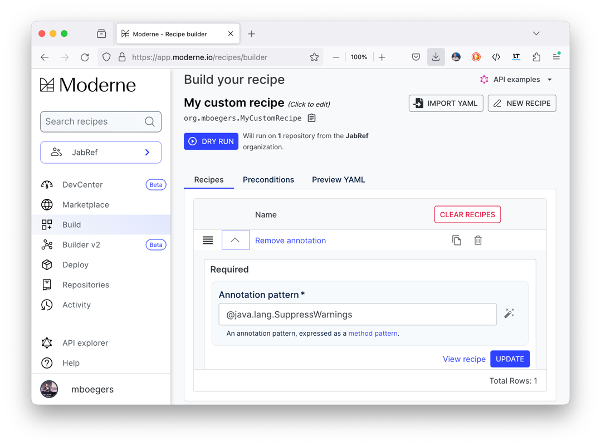
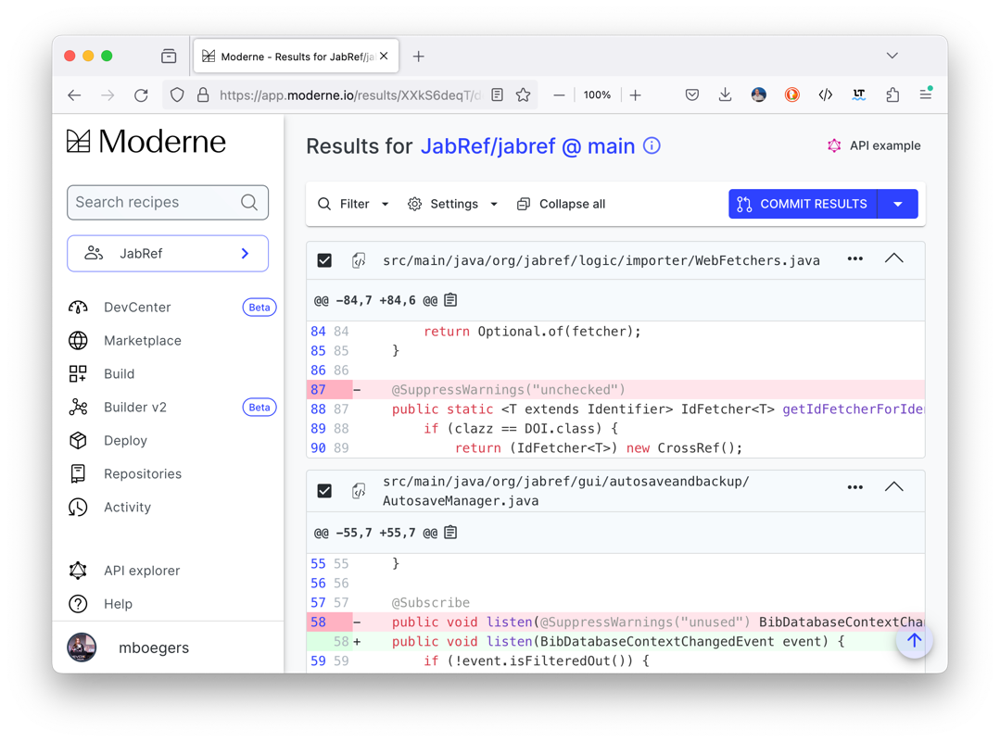
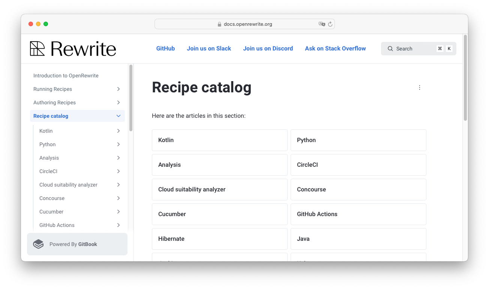
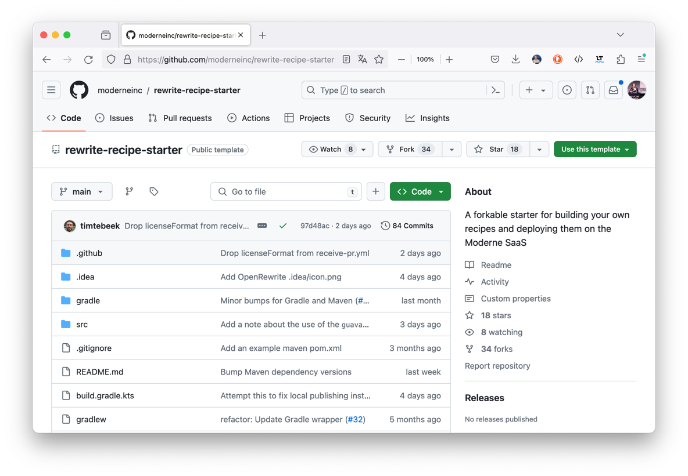

== Start migrating

image::images/man-ready-run-suit-full-shot.jpg[background]

=== Basic Migration Process

[%step]
. Run tests with high coverage ✅
. Identify needed Migration 🧐
. Configure Migrations ⌨️
. Execute Migrations 🛠️
. Build and Retest ✅
. Identify gaps 📋
. 🔃 🔃 .. 🔃

=== Basic Migration Process

. Run tests with high coverage ✅
. *Identify needed Migration* 🧐
. *Configure Migrations* ⌨️
. *Execute Migrations* 🛠️
. Build and Retest ✅
. Identify gaps 📋
. 🔃 🔃 .. 🔃

[.columns]
=== On Modern Platform

[.column.is-one-quater]
--
[start=2]
. *Identify*
. Configure
. Execute
--

[.column.is-three-quarters]
--

--

[.columns]
=== On Modern Platform

[.column.is-one-quater]
--
[start=2]
. Identify
. *Configure*
. Execute
--

[.column.is-three-quarters]
--
image::images/modern_builder_remove.png[]
--

[.columns]
=== On Modern Platform

[.column.is-one-quater]
--
[start=2]
. Identify
. *Configure*
. Execute
--

[.column.is-three-quarters]
--

--

[.columns]
=== On Modern Platform

[.column.is-one-quater]
--
[start=2]
. Identify
. Configure
. *Execute*
--

[.column.is-three-quarters]
--

--

[.columns]
=== On Modern Platform

[.column.is-one-quater]
--
[start=2]
. Identify
. Configure
. *Execute*
--

[.column.is-three-quarters]
--

--

[.columns]
=== Step by Step

[.column.is-one-quater]
--
[start=2]
. *Identify*
. Configure
. Execute
--

[.column.is-three-quarters]
--

--

[.columns]
=== Step by Step

[.column.is-one-quater]
--
[start=2]
. Identify
. *Configure*
. Execute
--

[.column.is-three-quarters]
--
[source,yaml]
....
---
type: specs.openrewrite.org/v1beta/recipe
name: example.RmAnnotation
displayName: Removes Suppression of Warnings
recipeList:
  - org.openrewrite.java.RemoveAnnotation:
      annotationPattern: \
        '@java.lang.SuppressWarnings'
....
--

[.columns]
=== Step by Step

[.column.is-one-quater]
--
[start=2]
. Identify
. Configure
. *Execute*
--

[.column.is-three-quarters]
--
[source,bash]
....
mvn -U org.openrewrite.maven:\
    rewrite-maven-plugin:run \
  -Drewrite.activeRecipes=\
    example.RmAnnotation
....

or with Gradle 🐘
--

=== Write your own

=== Moderne Starter

https://github.com/moderneinc/rewrite-recipe-starter[GH/ModerneInc/rewrite-recipe-starter]

=== Refaster Recipe

[source, java]
....
@RecipeDescriptor(
  name = "Replace oldOperation with betterOperation",
  description = "Replace deprecated ´oldOperation´ " +
                "with surrogate ´betterOperation´")
public static class ReplaceOldOperation {
  @BeforeTemplate
  public void oldOperation(SomeService s) {
    s.oldOperation();
  }
  @AfterTemplate
  public void newOperation(SomeService s) {
    s.betterOperation();
  }
}
....

=== Imperative Java

[source,java]
....
class A {
  void test() {
    int a;
    a = 0;
  }
}
....

[%step]
--
[source,bash]
....
-J.CompilationUnit
 \-J.ClassDeclaration
   |-J.Identifier | "A"
   \-J.Block
     \-J.MethodDeclaration | "MethodDeclaration{A{name=test,return=void,parameters=[]}}"
       |---J.Primitive | "void"
       |---J.Identifier | "test"
....
--
