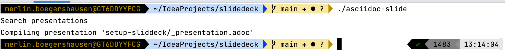
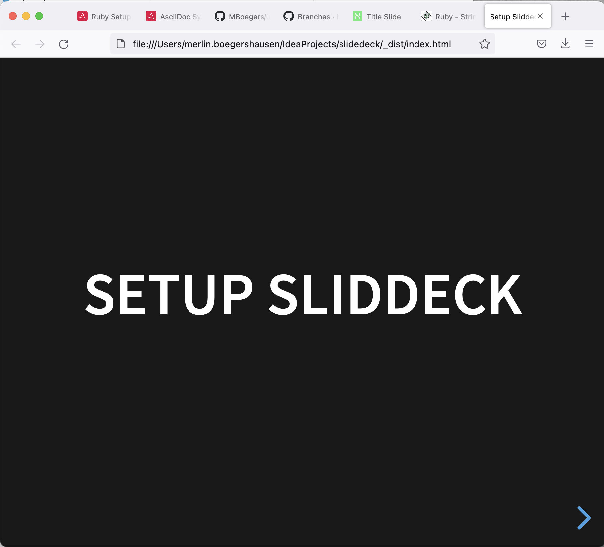

= Setup Sliddeck
:backend: revealjs
:revealjs_theme: adesso
:revealjs_controls: true
:revealjs_controlsTutorial: true
:revealjs_progress: false
:revealjs_slideNumber: false
:revealjs_history: true
:revealjs_center: true
:revealjs_transition: fade
:revealjs_backgroundTransition: fade
:source-highlighter: highlightjs

:imagedir: images

:icons: image
:icontype: svg
:iconsdir: ../../_shared/icons

:host-name: JavaLand
:host-url: https://www.javaland.eu
:host-logo-style: logo
:host-twitter-url: https://twitter.com/javalandconf
:host-twitter-name: @JavaLandConf

include::../../_shared/events-on-title-and-footer.adoc[]

== Content
* setup ruby
* setup ascii doctor
* build!

== Setup Ruby
Install via `brew install rbenv`

== Setup Ascii Docotor
Setup Gemfile and run `bundle config --local path .bundle/gems && budle`
[source,ruby]
----
source 'https://rubygems.org'
gem 'asciidoctor-revealjs'
----

== Build!
Run generation with `asciidoc-slides` and open in Browser

== Present
Open `index.html` in browser

icon:light[size=50px]

== Commands
* `clean` removes the _dist folder
* `build` compiles all presentations
* `watch` recompiles on changes in src folder

== Stuff
[quote, Monty Python and the Holy Grail]
____
Dennis: Come and see the violence inherent in the system. Help! Help! I'm being repressed!

King Arthur: Bloody peasant!
____

[.notes]
--
* tell anecdote
* make a point
--

include::../../_shared/about-slide.adoc[]
include::images/sources.adoc[]