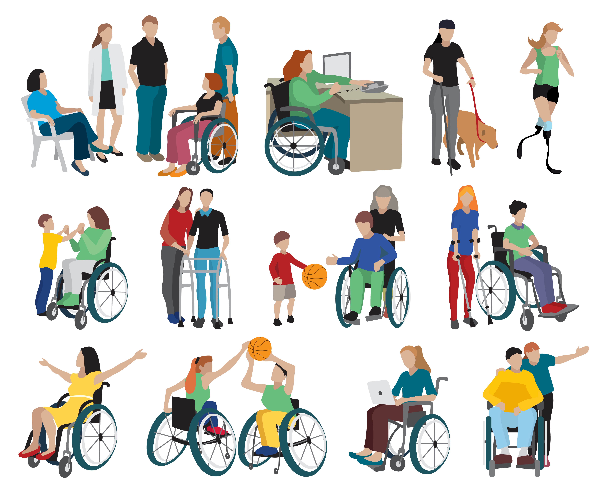
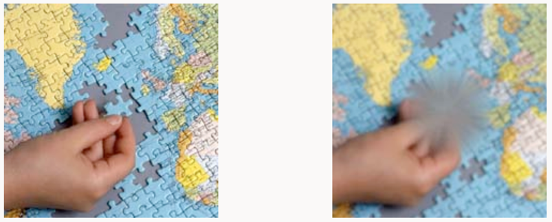

== Disabilities

[.notes]
--
Most people think about them.
Das sind 7.8Mio Deutsche, 9.4%, Ü64 24.7%, Schwerbehinderte.

Hohe Wahrscheinlichkeit, 6 Monate oder länger, Alterstypischer Lebenszustand beeinträchtigt zu mehr als 50%.

But most of these are abel to participate in the Web.
--

=== WCAG Disabilities

* visual 👁
* auditory 🦻
* physical 💪
* speech 🎤
* cognitive & neurological 🧠

[.notes]
--
Web Content Accessibility Guidelines

* in web application we are text based
* may contain video data
--

=== Colorblindness

est. 68% have regular vision, based on calculation of https://www.visionaustralia.org/[Vision Australia]

[.notes]
--
https://www.ichbinfarbenblind.de/[ichbinfarbenblind.de]

Orange is equal to green
--

=== Low vision

Age related Macular Degeneration 10-20% of western world, source https://www.gesundheitsinformation.de/altersabhaengige-makuladegeneration-amd.html#H%C3%A4ufigkeit[Gesundheitsinformation.de]

[.notes]
--
Optic nerve destroyed in the area of sharpest vision
--

=== Others

* Morbus Parkinson: 1%
* Trisomie 21: 0.3-0.4%

[%step]
--
* Elderly: >90%
--

Twitter-User are 4% of the world
