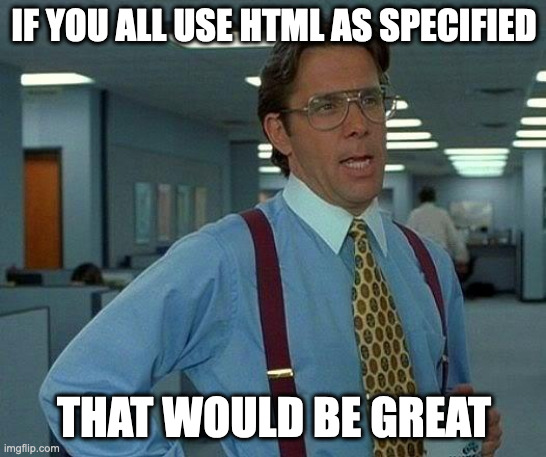

== W3C: Web Content Accessibility Guidelines

image::images/W3C.svg[background,size=cover]

[.notes]
--
* 61 Success Criteria with rating from A to AAA
* A to AAA, but AAA is not recommended as general target
* wir gehen 4 Beispiele durch
--

=== Info and Relationships

[quote,WCAG 2.1 1.3.1 Info and Relationships]
Information, structure, and relationships conveyed through presentation can be programmatically determined or are available in text.

*Level*: A

[.notes]
--
* headings are larger
* paragraphs seperated with blank-line
* lists have bullet-points/numbers
* headlines use landmarks
* provide for screen reader/browser
--

=== Exemplary Relationship

++++

   Social Security Number:
    * 
   <input size="3" type="text" aria-required="true" title="First 3 digits" style="font-size: 30px" /> -
   <input size="2" type="text" aria-required="true" title="Next 2 digits" style="font-size: 30px" /> -
   <input size="4" type="text" aria-required="true" title="Last 4 digits" style="font-size: 30px" />

++++

[%step]
--
[source,html]
....

    Social Security Number:
     * 
    <input size="3" type="text" aria-required="true"
        title="First 3 digits" /> -
    <input size="2" type="text" aria-required="true"
        title="Next 2 digits" /> -
    <input size="4" type="text" aria-required="true"
        title="Last 4 digits" />

....

https://www.w3.org/WAI/WCAG21/Techniques/aria/ARIA17.html[ARIA17] Using grouping roles to identify related form controls
--

[.notes]
--
* Grouping of inputs and labels
* here: grouping of inputs as Social Security Number
* some slide styling tags are used
--

=== Text Contrast

[quote,WCAG 2.1 1.4.3 Test Contrats]
The visual presentation of text and images of text has a contrast ratio of at least 4.5:1, except: large text has 3:1, Decoration, invisible parts or parts of pictures and Logos

*Level*: AA

[.notes]
--
* color is not a key factor
* aiming to people with moderately low vision
* non-informational parts are excluded
--

=== Example for bad contrast

++++

    <strong>NEW</strong>:
    <a href="https://www.w3.org/blog/2023/02/w3c-launches-beta-of-its-new-website/" style="color: #036">
        Redesigned site available for testing and feedback
    </a>.
    <a href="https://beta.w3.org/help/beta-site/">Set preferences</a>
    for the W3C site.

++++

[%step]
--

WhoCanUse analysis for https://www.whocanuse.com/?bg=cbe0fb&fg=003366&fs=16&fw=[original] and https://www.whocanuse.com/?bg=cbe0fb&fg=c8b600&fs=16&fw=[adesso] Banner from https://www.w3.org/[W3.org]
--

[.notes]
--
* here W3C Banner to advertise testing of new design
* once with original colors and with adesso link colors (ugly I know but that's not the point)
* WhoCanUse is a tool to simulate usages, we see it later
--

=== Labels

[quote,WCAG 2.3 3.3.2 Labels or Instructions]
Labels or instructions are provided when content requires user input.

*Level*: A

[.notes]
--
* provide instructions or labels, so user know what to do
* Radio buttons, checkboxes or combobox need label for each option
* provide format for inputs
--

=== Labels 'n' Instruction

++++
<form style="border: 1px solid">
    

        <label for="date">Extend date (yyyy-mm-dd)</label>
        <input type="text" style="font-size: 30px" size="10" id="date" value="2023-06-15" aria-labelledby="date-label date">
    

    

        <input type="submit" style="font-size: 30px" value="👍">
    

</form>
++++

[%step]
--
[source,html]
....
<form>
  

    
    <label for="date">Extend date (yyyy-mm-dd)</label>
    <input type="text" size="10" id="date"
      value="2023-06-15" aria-labelledby="date-label date">
  

  

    <input type="submit" style="font-size: 30px" value="👍">
  

</form>
....
--

[.notes]
--
* first span for older browsers
* Instruction like yyyy-mm-dd
* arialabelledby can also work across tables!
--

//=== 2.4.4 Link Purpose

=== HTML Content

[quote,WCAG 1.2 4.1.1 Parsing]
implemented using markup languages, elements have complete start and end tags, are nested according to their specifications, don't contain duplicate attributes and IDs are unique ...

[.notes]
--
except where the specifications allow these features
--

=== Example

[%step]

