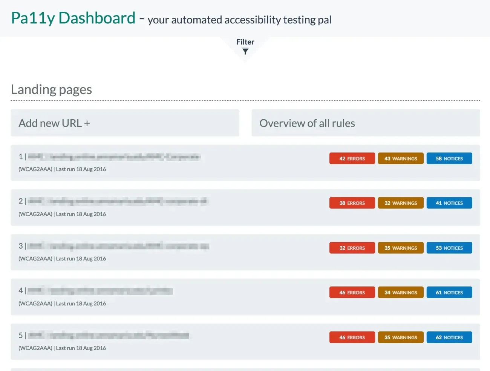

== Tools

image::images/diy-werkzeuge.jpg[background,size=cover]
[.notes]
--
I promissed to show some tools, here we go.
I will step thought them now and enter a demo directly afterwards.
--

[.columns]
=== AInspector

[.column.is-one-third]
image::images/aiinspector-plugin.png[]

[.column]
--
A Inspector checks WCAG rules for current page
--

=== Geenes

image::images/geenes-app.png[]

//https://geenes.app/editor/accessibility[Geenes.app] play with colors, see WCAG impact
[.notes]
--
Geenes.app to select best matches for back and foregrounds
--

=== Who can use

image::images/whocanuse-app.png[]

//https://www.whocanuse.com/[whocanuse.com] check for various visual impairments
[.notes]
--
whocanuse.com to check against common diseases
--

[.columns]
=== Pa11y Stack

[.column]

[.column]
image::images/pa11y-dashboard-task.jpg.webp[]

[.notes]
--
pa11y for automated checks and monitoring
--
