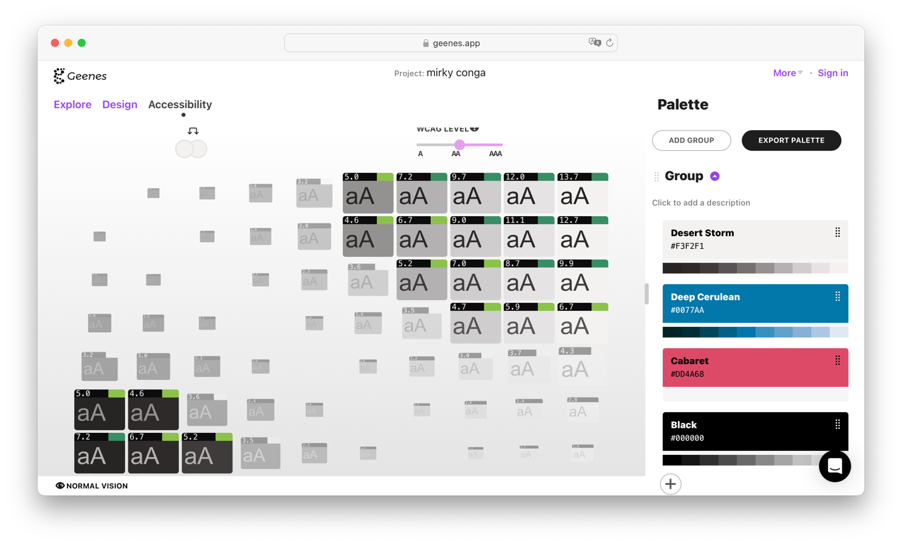

== Tools

[.columns]
=== Check WCAG

[.column.is-one-third]
image::images/aiinspector-plugin.png[]

[.column]
--
* https://addons.mozilla.org/de/firefox/addon/ainspector-wcag[AInspector WCAG] evaluates WCAG 2.0 against current page
* Has false negatives and requires manual checking (MC)
* Similar available for other browsers
--

=== Choose Colors

//https://geenes.app/editor/accessibility[Geenes.app] play with colors, see WCAG impact
[.notes]
--
* https://geenes.app/
* play with colors
* see WCAG impact
--

=== Check Colors

image::images/whocanuse-app.png[]

//https://www.whocanuse.com/[whocanuse.com] check for various visual impairments
[.notes]
--
* https://www.whocanuse.com/
* check for various visual impairments
* see distribution based on Australia
--

=== Testing

* VoiceOver
* ScreenReader Std
* GitHub App https://accesslint.com/[AccessLint]
* Firefox Plugin https://addons.mozilla.org/de/firefox/addon/wcag-contrast-checker[WCAG Contrast Checker]

=== Resources

* https://public-ui.github.io/docs[KoliBri] des ITZ Bund <- Components to use
* Vitaly Friedman https://www.smashingmagazine.com/2021/03/complete-guide-accessible-front-end-components/[A Complete Guide To Accessible Front-End Components] <- How to design

