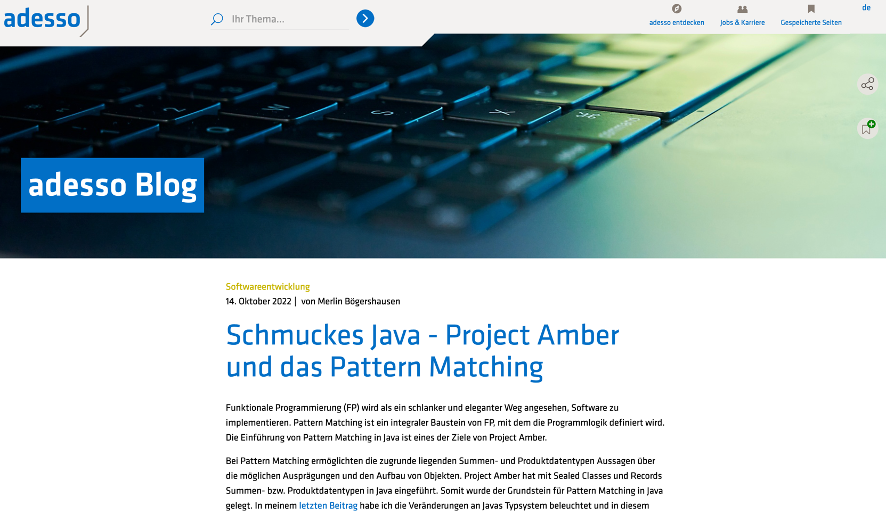
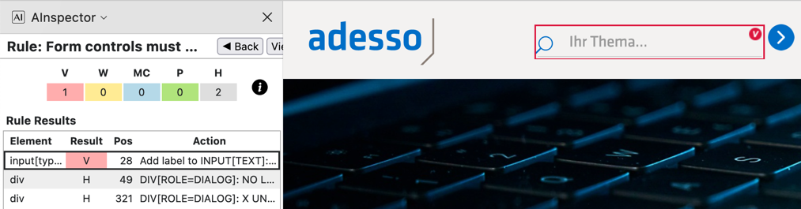
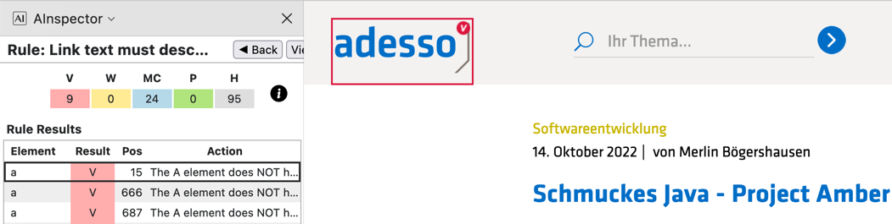
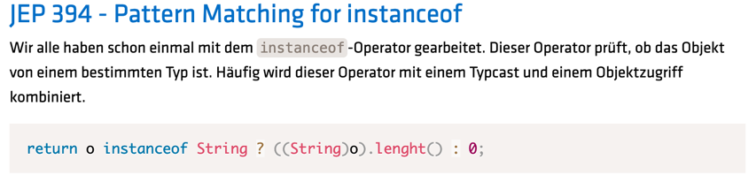
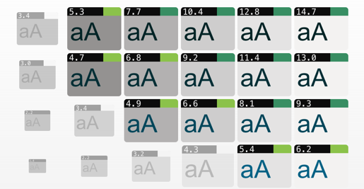

== Take care of own affairs

[.notes]
--
https://www.adesso.de/de/news/blog/index.jsp[adesso Dev Blog]
--

=== Missing Labels: Search

[%step]
--
[source,html]
....
<label id="adesso-search-label" for="adesso-search">Suche</label>
<!--..-->
<button type="submit" aria-label="Suche starten" class="adesso-round">
....
--

[.notes]
--
* the search has no context at all
* what are screen reader supposed to say?
* click
* simply a label and an aria-label
* demo if time
--

=== Link name description

[%step]
--
[source,html]
....
<a class="logo page-scroll" href="/de/index.jsp"
    title="to adesso Landingpage">
  <svg aria-label="Logo adesso" class="adesso-logo" role="img"/>
</a>
....
--

[.notes]
--
* first, where do we go?
* click
* thanks god there is an aria-label label at the image
* but no context at the link!
--

=== Text contrast

[%step]
* 3.59:1 - 100% 👎 +++instanceof+++
* 4.45:1 - 72% 👎 +++return+++
* 3.57:1 - 100% 👎 +++String+++
* 18.78:1 - 100% 👍 +++o+++

[.notes]
--
*  ? similar to instanceof

* https://www.whocanuse.com/?bg=f3f2f1&fg=887a75&fs=16&fw=[instanceof]
* https://www.whocanuse.com/?bg=f3f2f1&fg=0077aa&fs=16&fw=[return]
* https://www.whocanuse.com/?bg=f3f2f1&fg=dd4a68&fs=16&fw=[String]
* https://www.whocanuse.com/?bg=f3f2f1&fg=000000&fs=16&fw=[o]

--

=== Tinker the Colors

[%step]
--
* 4.45:1 - 72% 👎 +++return+++
* 6.16:1 - 7% 👎 +++return+++
--

[.notes]
--
* simply use 400 instead
* sunlight fails
--

=== Relationships

Article Heading [.step, step=1]#are *h1* 😕#

Section Heading [.step, step=2]#are *h4* 😖#

[%step]
--
[source,css]
....
.h1, h1 { /* h1 -> h2 */ }
.h2, h2 { /* h2 -> h1 */ }
.h3, h3 { /* copy 'n' paste h4 */ }
....
--

[.notes]
--
* i know, its lagacy, but do able!
--
