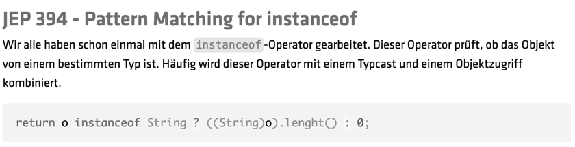
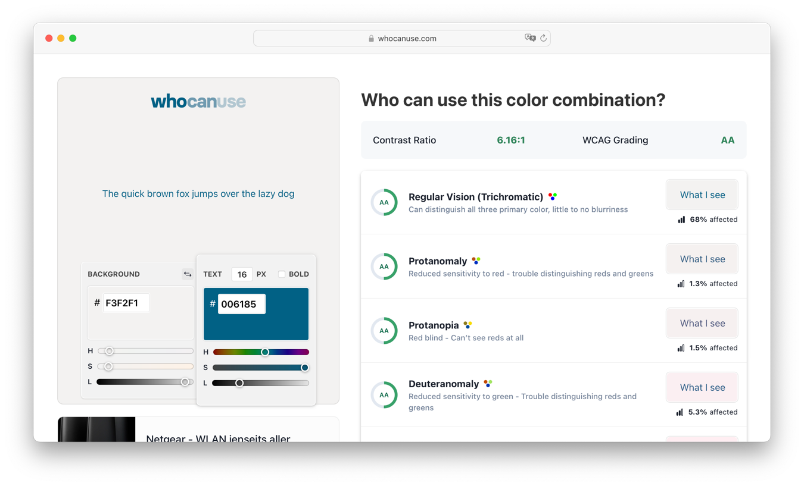
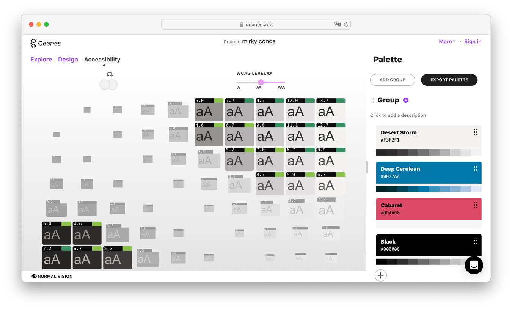
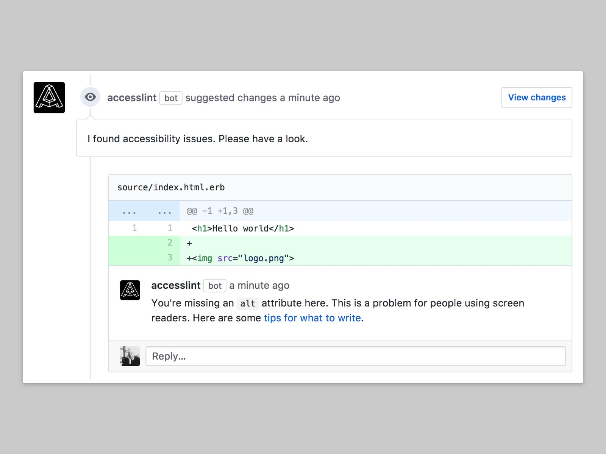

== What to try @Home

=== Create Awareness

Present with https://addons.mozilla.org/de/firefox/addon/wcag-contrast-checker[WCAG Contrast Checker] activated

[.columns]
=== Create Awareness

[.column.is-one-third]
--
image::images/nvda-logo.png[width=100]

image::images/voiceover_logo.png[width=100]
--

[.column.has-text-left]
--
Test with Screen Reader

* Open Source https://www.bhvd.de/bilder/nvda-box.png[NVDA]
* Apple https://www.apple.com/de/accessibility/vision/[VoiceOver]
* Windows https://support.microsoft.com/en-us/windows/complete-guide-to-narrator-e4397a0d-ef4f-b386-d8ae-c172f109bdb1[Narrator]
--

=== Optimize

Check your colors with https://www.whocanuse.com/[whocanuse.com]

=== Optimize

Little tweaks with https://geenes.app/[Geenes] may do the trick

=== Optimize

image::images/please_use_html.jpg[width=500]

*...*

=== Enable analysis

Use https://accesslint.com/[AccessLint] GitHub App on PRs

[.columns]
=== Enable analysis

[.column]
--
image::images/sonar-logo.svg[width=400]
Sonar HTML rules with tag https://rules.sonarsource.com/html/tag/accessibility[_accessibility_]
--

[.column]
--
image::images/eslint_logo_icon_170171.png[width=300]
ESLint Plugin https://www.npmjs.com/package/eslint-plugin-jsx-a11y[eslint-plugin-jsx-a11y]
--

=== Appropriate Framework

https://public-ui.github.io/[KoliBri - Public UI]

* Free Component Library 51 Components
* Separate structure from design
* React, Angular, Vue.js, Solid, Preact
* Designersystem for global styling

//=== READ

//Examples:

//* Vitaly Friedman https://www.smashingmagazine.com/2021/03/complete-guide-accessible-front-end-components/[A Complete Guide To Accessible Front-End Components] <- How to design
