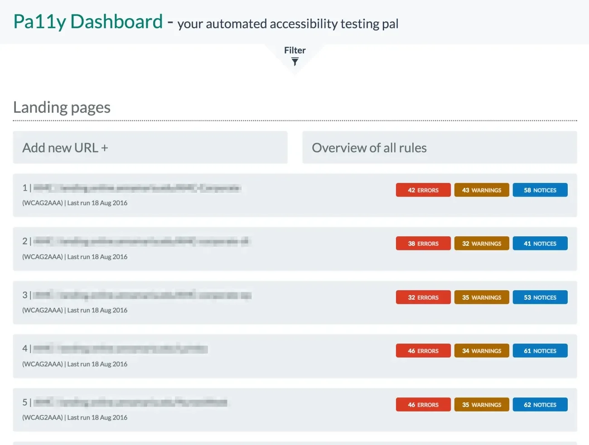
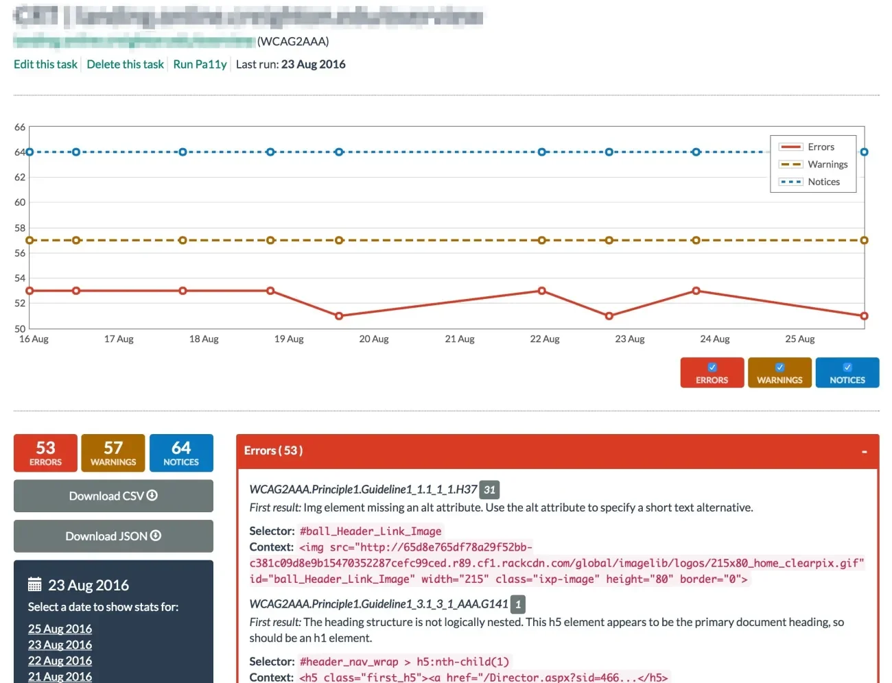

== What to try @Home

image::images/business-women-signature-document.jpg[background,size=cover]

=== Create Awareness

image::images/contrast_checker_action.png[]

Present with https://addons.mozilla.org/de/firefox/addon/wcag-contrast-checker[WCAG Contrast Checker] activated

[.columns]
=== Eat your own Dog Food

[.column.is-one-third]
--
image::images/nvda-logo.png[width=100]
image::images/ms_narrator.webp[width=100]
image::images/voiceover_logo.png[width=100]
--

[.column.has-text-left]
--
Test with Screen Reader

* Open Source https://www.bhvd.de/bilder/nvda-box.png[NVDA]
* Apple https://www.apple.com/de/accessibility/vision/[VoiceOver]
* Windows https://support.microsoft.com/en-us/windows/complete-guide-to-narrator-e4397a0d-ef4f-b386-d8ae-c172f109bdb1[Narrator]
--

=== Make Problems Visible

image::images/whocanuse-app.png[width=500]

Check your colors with https://www.whocanuse.com/[whocanuse.com]

=== Demonstrate Changes

image::images/geenes-app.png[width=500]

Little tweaks with https://geenes.app/[Geenes] may do the trick

=== Use proper HTML

image::images/please_use_html.jpg[width=500]

*...*

=== Automated with Pa11y

https://pa11y.org/[pa11y] - Toolkit to test accessibility

CI integration available as https://pa11y.org/[pa11y-ci]

[source,bash]
--
brew install node
npm install -g pa11y
pa11y https://www.adesso.de/de/news/blog/index.jsp
--

[source,bash]
....
Results for URL: https://www.adesso.de/de/news/blog/index.jsp
 • Error: This element has insufficient contrast at this conformance level. Expected a contrast ratio of at least 4.5:1, but text in this element has a contrast ratio of 2.1:1. Recommendation:  change text colour to #616161.
   ├── WCAG2AA.Principle1.Guideline1_4.1_4_3.G18.Fail
   ├── #ppms_cm_footer__powered_by
   └── Powered by
....

[.columns]
=== Monitor with Pa11y

[.column]
--

--

[.column]
--

--

=== Appropriate Framework

image::images/kolibri_logo.png[width=300]

https://public-ui.github.io/[KoliBri - Public UI]

* Free Component Library 51 Components
* Separate structure from design
* React, Angular, Vue.js, Solid, Preact
* Designersystem for global styling

//=== READ

//Examples:

//* Vitaly Friedman https://www.smashingmagazine.com/2021/03/complete-guide-accessible-front-end-components/[A Complete Guide To Accessible Front-End Components] <- How to design
