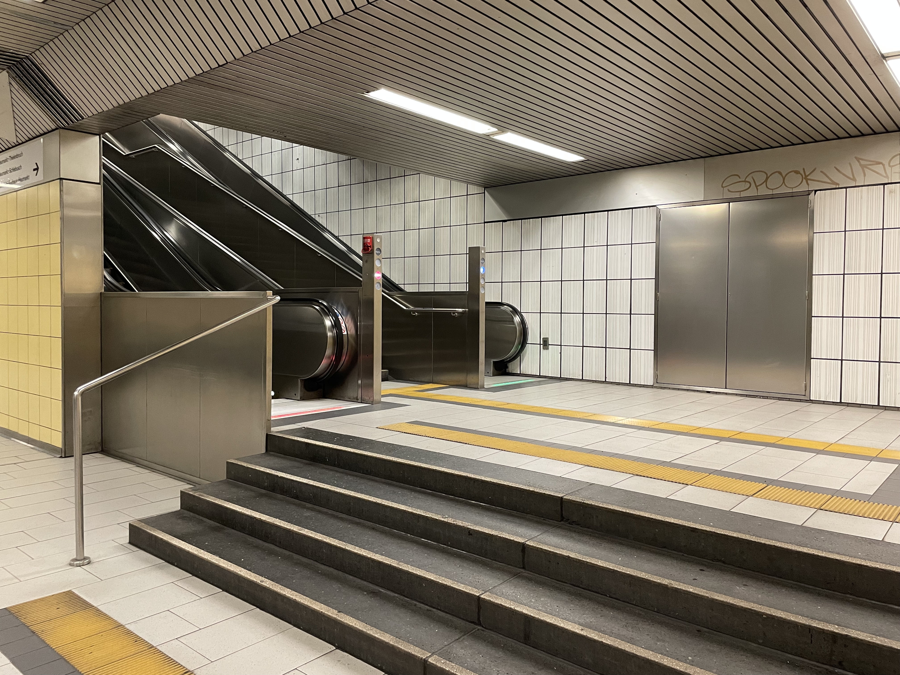

= Accessibility: in the Web
:backend: revealjs
:revealjs_theme: adesso
:revealjs_controls: false
:revealjs_controlsTutorial: false
:revealjs_progress: false
:revealjs_slideNumber: false
:revealjs_history: true
:revealjs_center: true
:revealjs_transition: fade
:revealjs_backgroundTransition: fade

:imagedir: images

:icons: image
:icontype: svg
:iconsdir: ../../_shared/icons

// Edit host information
:host-name: DEVOXX Belgium 2023
:host-url: https://devoxx.be/
:host-logo-style: logo
:host-logo-url: ../../_shared/images/hosts/DEVOXX-Name-Only-TransparentBackground.png
:host-twitter-url: https://twitter.com/Devoxx
:host-twitter-name: @Devoxx

include::../../_shared/hightlightjs.adoc[]
include::../../_shared/events-on-title-and-footer.adoc[]

[.notes]
--
Hi Merlin, Software Engineer bei adesso.

In einer Zeit in der auf fast allen Bühnen/Medien lauthals und inhaltslos gegen Personengruppen gewettert wird, möchte ich etwas tun.

Und das einfachste, abgesehen davon meinen Mund aufzumachen, wenn ich Zeuge von faschistischer, nationalistischer, generell diskriminierender Situationen werde, ist es jedem Menschen gleichberechtigt die Teilhabe am Leben zu ermöglichen.
--

// ####################################################
// #            Presentation area  start              #
// ####################################################

== 😣

[.notes]
--
Im Fall des Köln U-Bahnhofes Friedendsplatz wurde es versucht, aber ich denke das Ergebnis ist noch frustrierender als es gar nicht erst zu tun.

Meine Oma ist 85 und stürzt regelmäßig auf Bahnhoftreppen. (es sind ja nur die 4 Stufen)

Es gab wirklich keinen Fahrstuhl, ich habe extra die U-Bahn fahren lassen und habe nach geschaut.

Bevor wir uns einem Beispiel zuwenden lasst uns erstmal schauen, was wir überhaupt tun sollten.
Damit wir die zweite Rolltreppe vergessen.
--

include::01_understand_problem.adoc[]

include::03_tools_we_use_today.adoc[]
include::04_devblog_findings.adoc[]
include::05_what_can_I_do.adoc[]

== ‼️

[.notes]
--
Please keep in mind!
Think till the end.
--

// ####################################################
// #            Presentation area  end                #
// ####################################################
include::../../_shared/about-slide.adoc[]
include::images/_sources.adoc[]
