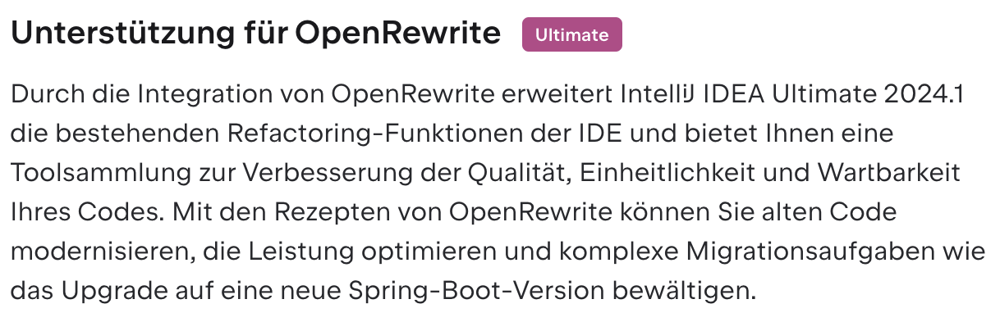

= Open Rewrite: Kickstarter Recipe Dev
:backend: revealjs
:revealjs_theme: adesso
:revealjs_controls: false
:revealjs_controlsTutorial: false
:revealjs_progress: false
:revealjs_slideNumber: false
:revealjs_history: true
:revealjs_center: true
:revealjs_transition: fade
:revealjs_backgroundTransition: fade

:imagedir: images

:icons: image
:icontype: svg
:iconsdir: ../../_shared/icons

// Edit host information
:host-name: Javaland
:host-url: https://www.javaland.eu
:host-logo-style: logo
:host-logo-url: ../../_shared/images/hosts/logo_javaland.png
:host-twitter-url: https://twitter.com/JavaLandConf
:host-twitter-name: @JavaLandConf

include::../../_shared/hightlightjs.adoc[]
include::../../_shared/events-on-title-and-footer.adoc[]
// ####################################################
// #            Presentation area  start              #
// ####################################################

== Idee

++++
<table style="border: none">
<tr>
<td>
++++
//image::images/junit4-logo.png[height=64]
TestNG
++++
</td>
<td style="justify-content: center"> ➜ </td>
<td>
++++
//image::images/junit5-logo.png[height=64]
JUnit 🪐
++++
</td>
</tr>
</table>
++++

[%step]
--
😂 EASY! 🤣
--

=== 🧾JDK/JDK-8301767

see https://bugs.openjdk.org/browse/JDK-8301767

=== 📝GitHub PR

see https://github.com/openjdk/jdk/pull/12426

=== 📋ToDo's

[%step]
. Migrate `@Before` to JUnit 🪐 API
. Migrate Assertions methods
. Migrate `@Test` Annotation
. Grab a drink 🍹🥂🍻🍷☕️

== Setup

=== IntelliJ Idea 2024.1

=== Project

. ⤵️ https://github.com/moderneinc/rewrite-recipe-starter[Moderne Inc./Rewrite Recipe Starter]
. 👩🏼‍💻Manipulate GAV
. verify setup with `mvn test`
. 🚮 Example Content

=== Dependency

[source,xml]
----
<dependency>
    <groupId>org.testng</groupId>
    <artifactId>testng</artifactId>
    <version>7.7.0</version>
    <scope>compile</scope>
</dependency>
<dependency>
    <groupId>org.junit.jupiter</groupId>
    <artifactId>junit-jupiter-api</artifactId>
    <scope>compile</scope>
</dependency>
----

== 🧾 Development

=== ✅ Migrate Setup

|===
|From |To

|`@BeforeClass`
|`@BeforeAll`

|`@AfterClass`
|`@AfterAll`

|`@BeforeMethod`
|`@BeforeEach`

|`@AfterMethod`
|`@AfterEach`

|===

=== 🧾 Migrate Setup
`src/main/resources/META-INF/rewrite`

[source,yaml]
----
type: specs.openrewrite.org/v1beta/recipe
name: io.github.mboegers.openrewrite.TestNgToJUnitJupiter
displayName: Migrate Test NG tests to JUnit Jupiter
description: Migrate Test NG annotations and assertions ...
recipeList:
  - org.openrewrite.java.ChangeType:
      oldFullyQualifiedTypeName: org.testng.annotations.BeforeClass
      newFullyQualifiedTypeName: org.junit.jupiter.api.BeforeAll
      ignoreDefinition: true
----

=== ✅ Migrate Assertions

[source,java]
----
import org.testng.Assert;

class MyTest {
  void testMethod() {
    boolean actual, expected;
    Assert.assertEquals(actual, expected, "😣");
  }
}
----

[source,java]
----
import org.junit.jupiter.api.Assertions;

class MyTest {
  void testMethod() {
    boolean actual, expected;
    Assertions.assertEquals(expected, actual, "😣");
  }
}
----

=== 🧾Migrate Assertions

[source,java]
----
@RecipeDescriptor(
  name = "Replace `Assert#assertEquals(?, ?)`",
  description = "Replace `org.testng.Assert#assertEquals(?, ?)` with `org.junit.jupiter.api.Assertions#assertEquals(?, ?)`."
)
public static class MigrateObjectAssert {
  @BeforeTemplate
  void before(Object actual, Object expected) {
    Assert.assertEquals(actual, expected);
  }
  @AfterTemplate
  void after(Object actual, Object expected) {
    Assertions.assertEquals(expected, actual);
  }
}
----

=== ✅ Migrate @Test

[source,java]
----
import org.testng.annotations.Test;

class MyTest {
  @Test()
  void test() {}
}
----
[source,java]
----
import org.junit.jupiter.api.Test;

class MyTest {
  @Test
  void test() {}
}
----

=== Edge case

[source,java]
----
import org.testng.annotations.Test;

class MyTest {
  @Test(enabled = false)
  void test() {}
}
----

=== 🧾 Migrate @Test

If a MethodDeclaration

* annotated with `o.t.a.Test`
* and `@Test` has not Parameter

then

. add `@o.j.j.a.Test`
. add import `o.j.j.a.Test`
. remove `o.t.a.Test` with https://docs.openrewrite.org/recipes/java/removeannotation[Remove annotation]

== Call for Action

=== Further Information

* https://docs.openrewrite.org/
* https://www.youtube.com/@moderne-auto-remediation
* Dive deeper with https://docs.openrewrite.org/concepts-explanations

=== Renovate Java with Java

Join me on helping OpenJDK to migrate from TestNG to JUnit 🪐

https://github.com/MBoegers/migrate-testngtojupiter-rewrite[MBoegers/migrate-testngtojupiter-rewrite]

// ####################################################
// #            Presentation area  end                #
// ####################################################
include::../../_shared/about-slide.adoc[]
include::images/_sources.adoc[]
